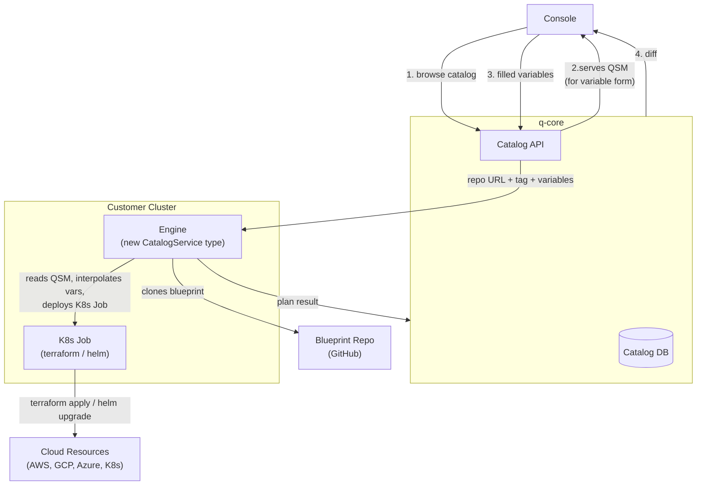
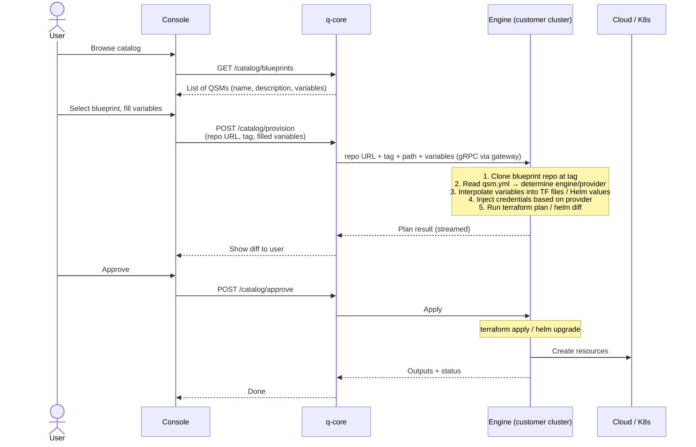
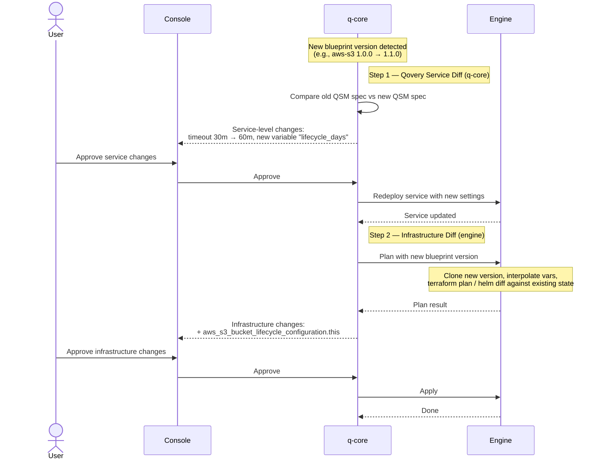
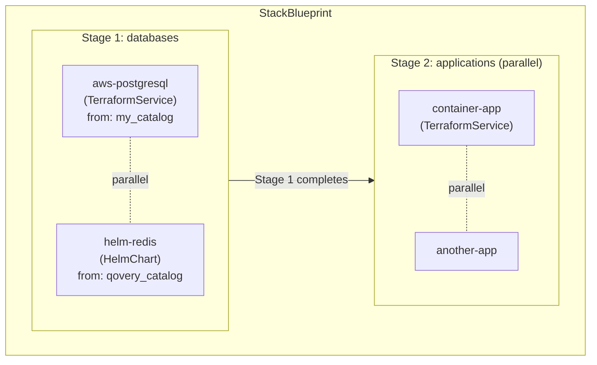

# Service Catalog -- Architecture

## Overview

A blueprint is a **QSM manifest** (`qsm.yml`) paired with either **Terraform files** or **Helm values**.

- **q-core** serves the QSM to the Console (so the UI renders the variable form), receives filled variables back, and forwards them along with the git repo URL to the engine. q-core also handles the QSM-level diff on catalog updates (Step 1) and StackBlueprint stage orchestration.
- **The engine** clones the blueprint repo, reads the QSM to determine what to run (terraform/helm), interpolates variables, runs plan/apply, and streams results back. The engine needs a **new CatalogService type** for this.
- `spec.engine` determines what runs: `terraform`, `opentofu`, or `helm`
- `spec.provider` (terraform/opentofu only) determines which credentials the engine injects

All diagrams: [Excalidraw](diagrams/architecture.excalidraw).

---

## Architecture



q-core serves the QSM, forwards variables, stores plans, and orchestrates stacks. The engine owns cloning, QSM interpretation, variable interpolation, and execution.

---

## Engine / Provider Mapping

The engine reads `spec.engine` and `spec.provider` from the QSM after cloning the blueprint repo:

| `spec.engine` | `spec.provider`       | What the engine runs               | Credentials Injected                         |
| ------------- | --------------------- | ---------------------------------- | -------------------------------------------- |
| `terraform`   | `aws`                 | Terraform CLI                      | `AWS_ACCESS_KEY_ID`, `AWS_SECRET_ACCESS_KEY` |
| `terraform`   | `gcp`                 | Terraform CLI                      | `GOOGLE_CREDENTIALS`                         |
| `terraform`   | `azure`               | Terraform CLI                      | `ARM_CLIENT_ID`, `ARM_CLIENT_SECRET`, ...    |
| `terraform`   | `qovery`              | Terraform CLI                      | `QOVERY_API_TOKEN`                           |
| `terraform`   | `helm`                | Terraform CLI (with helm provider) | `KUBECONFIG`                                 |
| `opentofu`    | _(same as terraform)_ | OpenTofu CLI                       | _(same as terraform)_                        |
| `helm`        | _(none )_             | Helm CLI                           | `KUBECONFIG`                                 |

### Blueprint contents by engine type

| Engine                   | Blueprint contains                                                                |
| ------------------------ | --------------------------------------------------------------------------------- |
| `terraform` / `opentofu` | `qsm.yml` + `.tf` files (`main.tf`, `variables.tf`, `outputs.tf`, `providers.tf`) |
| `helm`                   | `qsm.yml` + `values.yaml` (chart source declared in QSM `spec.chart`)             |

---

## Provisioning Flow



---

## Catalog Update -- Two-Step Diff

When a blueprint version is bumped (e.g., `aws-s3` `1.0.0` → `1.1.0`), two things may have changed:

1. **Qovery service** (aka QSM spec): timeout, CPU/RAM, variables, advanced settings -- things that affect the Qovery service definition itself.
2. **Infrastructure** (TF code / Helm values): resources, configurations -- things that affect the actual cloud resources.

These are diffed and approved **sequentially**, because Qovery service changes (Step 1) may affect the infrastructure diff (Step 2). For example, a new environment variable added in the QSM might be referenced by the updated terraform code.



### Scenarios

| QSM spec changed?  | TF/Helm code changed? | What happens                                                |
| ------------------ | --------------------- | ----------------------------------------------------------- |
| Yes                | Yes                   | Both steps run sequentially                                 |
| Yes                | No                    | Only Step 1. No infrastructure diff needed.                 |
| No                 | Yes                   | Step 1 skipped. Only Step 2.                                |
| No (metadata only) | No                    | No diff at all. q-core updates the catalog entry instantly. |

---

## StackBlueprint Orchestration

A StackBlueprint composes multiple ServiceBlueprints from potentially **different catalog repos** [To later support customer's catalog] into a single deployable unit. q-core breaks the stack into individual services and sends them to the engine one stage at a time. [@Romain G/Fabien to confirm]



- **Stages** execute sequentially (top to bottom)
- **Services within a stage** execute in parallel
- Each service gets its own independent plan, approval, and state
- Each service specifies its own `url` (catalog repo) -- a stack can mix blueprints from different repos
- q-core handles stage orchestration: it sends services to the engine one stage at a time, waits for completion, then sends the next. The engine doesn't know about stacks.
- The Console renders variable forms for every service in the stack. Users fill all variables before provisioning starts.

---

## Engine Integration

The engine needs a **new CatalogService type** to handle catalog blueprints. It cannot reuse the existing TerraformService or HelmChart directly because:

- The source is a catalog blueprint reference (repo URL + tag + path), not a user's git repo or Helm registry
- The engine must read the QSM to determine whether to run terraform, opentofu, or helm...
- Variable interpolation into TF files / Helm values happens in the engine
- The plan result needs to be captured as structured data (not just log lines) and sent back to q-core

### What q-core handles

- **QSM serving**: reads `qsm.yml` from the blueprint repo, serves it to the Console for variable form rendering
- **Variable forwarding**: receives filled variables from the Console, forwards them to the engine along with the repo URL + tag
- **QSM spec diff** (Step 1 of two-step diff): compares old vs new QSM spec, shows service-level changes
- **StackBlueprint orchestration**: breaks stacks into individual services, sequences stages, sends one batch of services per stage to the engine
- **Plan storage**: stores plan results from the engine for display and audit
- **Version management**: detects new blueprint versions via git tags, notifies users of available updates

### What the engine handles

- **Blueprint fetching**: clones the blueprint repo at the specified tag
- **QSM reading**: parses `qsm.yml` to determine `engine`, `provider`, variables, chart config
- **Variable interpolation**: injects user + qovery variables into TF files (`terraform.tfvars.json`) or Helm values (`values.yaml`)
- **Credential injection**: based on `spec.provider`, injects the appropriate credentials (AWS keys, GCP SA, kubeconfig, etc.)
- **Execution**: runs terraform init/plan/apply or helm diff/upgrade inside a K8s Job
- **Plan streaming**: captures the plan output (`terraform show -json` / `helm diff`) and streams it back to q-core as structured data
- **State management**: terraform state stored in k8s `Backend::Kubernetes`

### Engine changes needed

- New `CatalogService` type in the IO model (`io_models/catalog_service.rs`) and domain model (`environment/models/catalog_service.rs`)
- New deployment action (`environment/action/deploy_catalog_service.rs`) that handles clone → read QSM → interpolate → execute
- New Helm chart template (`lib/common/charts/q-catalog-service/`) for the K8s Job that runs the catalog blueprint
- `ServiceType::CatalogService` added to the enum in `cloud_provider/service.rs`
- `Transmitter::CatalogService` added to the events system

---

## QSM Format Reference

### ServiceBlueprint (Terraform)

```yaml
apiVersion: "qovery.com/v2"
kind: ServiceBlueprint

metadata:
  name: "aws-s3"
  version: "1.0.0"
  description: "S3 bucket with encryption and versioning"
  icon: "https://cdn.qovery.com/icons/s3.svg"
  categories: ["storage", "s3"]

spec:
  engine: terraform # terraform | opentofu | helm
  provider: aws # aws | gcp | azure | qovery | helm

  qoveryVariables: # auto-filled from cluster/env context
    - name: "region"
      source: "cluster.region"
      overridable: true

  userVariables: # shown in the provisioning form
    - name: "bucket_name"
      type: "string"
      required: true
      description: "S3 bucket name"

  outputs:
    - name: "bucket_arn"
      description: "Bucket ARN"
      sensitive: false
```

### ServiceBlueprint (Helm)

```yaml
apiVersion: "qovery.com/v2"
kind: ServiceBlueprint

metadata:
  name: "helm-redis"
  version: "1.0.0"
  description: "Redis cache via Bitnami Helm chart"
  categories: ["cache", "redis"]

spec:
  engine: helm

  chart:
    repository: "https://charts.bitnami.com/bitnami"
    name: "redis"
    version: "19.x"

  qoveryVariables:
    - name: "namespace"
      source: "cluster.namespace"

  userVariables:
    - name: "replica_count"
      type: "number"
      default: "1"
    - name: "password"
      type: "string"
      required: true
```

### StackBlueprint

Composes ServiceBlueprints from one or more catalog repos. Each service specifies its `url` (catalog repo) and `version`. q-core breaks the stack into stages and sends each stage to the engine. [@Romain / Fabien ?] The Console renders variable forms for every service so the user fills everything upfront.

```yaml
apiVersion: "qovery.com/v2"
kind: StackBlueprint

metadata:
  name: "production-stack"
  version: "1.0.0"
  description: "PostgreSQL + Redis + API"
  categories: ["stack"]

spec:
  stages:
    - name: "databases"
      description: "Provision databases and caches first"
      services:
        - blueprint: "aws-postgresql"
          url: "https://github.com/my-org/my-catalog.git"
          version: ">=1.0.0 <2.0.0"
          name: "main-db"
        - blueprint: "aws-redis"
          url: "https://github.com/Qovery/service-catalog.git"
          version: "1.x"
          name: "cache"
    - name: "applications"
      description: "Deploy application after databases are ready"
      services:
        - blueprint: "container-app"
          url: "https://github.com/Qovery/service-catalog.git"
          version: "1.0.0"
          name: "api"
```

### Versioning

Git-tag-based semver: `{blueprint-name}/{major}.{minor}.{patch}`

```
aws-s3/1.0.0
helm-redis/1.1.0
production-stack/2.0.0
```

| Change                            | Minor/Patch             | Major |
| --------------------------------- | ----------------------- | ----- |
| Add variable with default         | Yes                     | --    |
| Add variable without default      | --                      | Yes   |
| Remove/rename variable            | --                      | Yes   |
| Add output                        | Yes                     | --    |
| Remove output                     | --                      | Yes   |
| Change engine or provider         | --                      | Yes   |
| Metadata only (icon, description) | Instant update, no diff | --    |
