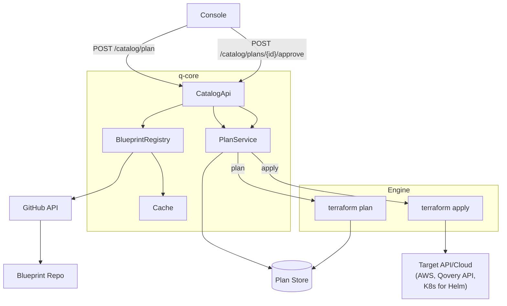

# Qovery Service Catalog -- Implementation Plan

> **Status:** Draft v6.0
> **Date:** 2026-03-17

---

## 1. Product Decisions

| # | Decision | Choice |
|---|----------|--------|
| P1 | Core concept | The catalog is a **plan-and-approve layer** on top of Terraform. Blueprints declare resources using any Terraform provider (AWS, GCP, Helm, Qovery, etc.). Users review a `terraform plan` before anything is applied. |
| P2 | Blueprint scope | A single blueprint can create any cloud or Qovery resource. StackBlueprints compose multiple services with pipeline stages. |
| P3 | Provider model | `spec.provider` determines what credentials the engine injects (`aws` → AWS creds, `qovery` → API token, `helm` → kubeconfig). |
| P4 | Dependency model | StackBlueprints use ordered stages. Services within a stage run in parallel, stages run sequentially. |
| P5 | Versioning | Git-tag-based semver: `{blueprint-name}/{semver}`. |
| P6 | Provisioning workflow | **Plan → Review → Approve → Apply.** Always. |

---

## 2. Technical Decisions

| # | Decision | Choice |
|---|----------|--------|
| T1 | Blueprint repository | `github.com/Astach/service-catalog` |
| T2 | Runtime | Always **Terraform**. No separate Helm engine -- Helm charts are deployed via the `helm_release` Terraform resource. |
| T3 | Provider = credential selector | `spec.provider` tells the engine which credentials to inject. `aws` → cluster AWS creds. `qovery` → `QOVERY_API_TOKEN`. `helm` → kubeconfig. |
| T4 | Plan storage | Plans (JSON + binary planfile) stored in DB. Statuses: `PENDING_REVIEW`, `APPROVED`, `APPLIED`, `REJECTED`, `EXPIRED`, `FAILED`. |
| T5 | State storage | Each provisioned stack gets its own TF state in Kubernetes backend (Secret on customer's cluster). |
| T6 | Where TF runs | On Qovery's infrastructure (engine). |
| T7 | Cache | In-memory in q-core. Invalidated by GitHub webhook. |
| T8 | Version index | Built from git tags via GitHub API. |
| T9 | Service binding | `catalog_service` record in DB links provisioned instance → blueprint name + version + TF state. |

---

## 3. User Journey

### Browsing

1. Navigate to environment → open Service Catalog
2. Provider filter pre-set to cluster's cloud provider
3. Filter by categories, search by name

### Provisioning (Plan → Approve)

1. Click "Provision" on a blueprint card
2. Fill in variables (form from `qsm.yml`). Qovery variables are pre-filled, some overridable.
3. Engine runs `terraform plan` → user reviews what will be created/changed/destroyed
4. User approves → `terraform apply plan.bin`
5. Resources created. Service tracked in `catalog_service` record.

### Upgrading

1. "Update available" badge (q-core compares version against index)
2. Click "Review Update" → `terraform plan` with new version against existing state
3. Review diff → approve → apply

---

## 4. Architecture



### Credential Injection

| `spec.provider` | Credentials the engine injects |
|---|---|
| `aws` | AWS access key/secret (from cluster config) |
| `gcp` | GCP service account JSON (from cluster config) |
| `azure` | Azure SP credentials (from cluster config) |
| `qovery` | `QOVERY_API_TOKEN` (org-scoped) |
| `helm` | Kubeconfig (from cluster) |

---

## 5. Versioning

### Git Tags

```
Format:    {blueprint-name}/{major}.{minor}.{patch}
Examples:  aws-s3/1.0.0
           managed-postgresql/1.1.0
           helm-prometheus/1.0.0
```

### Release Flow

1. Update blueprint + bump `metadata.version`
2. PR to `main` → CI validates
3. Merge → tag → push tag
4. Release CI validates tag matches QSM + backwards compat
5. Webhook → cache invalidated

### Semver Rules

| Change | Minor/Patch OK? | Major? |
|--------|-----------------|--------|
| Add `userVariable` with default | Yes | No |
| Add `userVariable` without default | No | Yes |
| Remove/rename variable | No | Yes |
| Change `default` value | Yes | No |
| Add `output` | Yes | No |
| Remove `output` | No | Yes |
| Change `provider` | No | Yes |

---

## 6. QSM Contract

### ServiceBlueprint

```yaml
apiVersion: "qovery.com/v2"
kind: ServiceBlueprint

metadata:
  name: "aws-s3"
  version: "1.0.0"
  description: "S3 bucket with encryption and versioning"
  icon: "https://cdn.qovery.com/icons/s3.svg"
  categories: ["storage", "s3"]

spec:
  provider: "aws"            # determines credentials injected by engine

  qoveryVariables:           # auto-filled by q-core from cluster/env context
    - name: "region"
      source: "cluster.region"
      overridable: true      # user CAN override
    - name: "qovery_cluster_name"
      source: "cluster.name"
      overridable: false     # locked

  userVariables:
    - name: "bucket_name"
      type: "string"
      required: true
      description: "S3 bucket name"

  outputs:
    - name: "bucket_arn"
      description: "Bucket ARN"
      sensitive: false
```

### StackBlueprint (compose existing ServiceBlueprints)

A StackBlueprint has no Terraform files of its own. It references existing catalog ServiceBlueprints, pre-configures variables, and orchestrates deployment via stages.

```yaml
apiVersion: "qovery.com/v2"
kind: StackBlueprint

metadata:
  name: "production-stack"
  version: "1.0.0"
  description: "PostgreSQL + Redis + web application"
  categories: ["stack", "database", "cache"]

spec:
  stages:
    - name: "databases"
      description: "Provision databases and caches first"
      services:
        - blueprint: "aws-postgresql"
          version: ">=1.0.0 <2.0.0"   # version constraint (exact, train, or range)
          alias: "main-db"             # service name + env var prefix
          variables:                   # pre-configured variable overrides
            instance_class: "db.r6g.large"
            multi_az: "true"
            disk_size: "100"

        - blueprint: "aws-redis"
          version: "1.x"              # version train: latest 1.x.x
          alias: "cache"
          variables:
            node_type: "cache.r6g.large"

    - name: "applications"
      description: "Deploy app after databases are ready"
      services:
        - blueprint: "container-app"
          version: "1.0.0"
          alias: "api"
          variables:
            app_name: "api-server"
            image_name: "my-org/api"
```

**How it works:**
- Stages execute sequentially (top to bottom). Services within a stage are planned/applied in parallel.
- Each service gets its own independent `terraform plan` and TF state.
- `qoveryVariables` are resolved per-service from the referenced ServiceBlueprint's QSM.
- `variables` in the stack override `userVariables` defaults from the ServiceBlueprint.
- Version constraints: `"1.2.0"` (exact), `"1.x"` (latest 1.x.x), `">=1.0.0 <2.0.0"` (range).

### Qovery Variable Sources

| Source | Resolved From |
|--------|---------------|
| `environment.id` | `Environment.id` |
| `project.id` | `Project.id` |
| `organization.id` | `Organization.id` |
| `organization.container_registry_id` | Default container registry |
| `cluster.name` | `KubernetesProvider.name` |
| `cluster.region` | `CloudProviderRegion` |
| `cluster.vpc_id` | `InfrastructureOutputs.vpcId` |
| `cluster.namespace` | Default namespace |

### Metadata-Only Updates

When a new version only changes `metadata` fields (description, icon, categories) and `spec` is identical, q-core updates the catalog entry immediately. No plan/apply, no engine run.

---

## 7. Service Binding

Each provisioned blueprint instance is tracked by a `catalog_service` record in q-core's DB:

| Field | Description |
|-------|-------------|
| `id` | Unique instance identifier |
| `environment_id` | Target environment |
| `blueprint_name` | e.g. `aws-s3` |
| `blueprint_version` | Version at provisioning time |
| `terraform_state_ref` | Reference to K8s Secret holding TF state |
| `variables` | User-provided values |

This is how q-core knows "this service was created from blueprint X at version Y" -- enabling upgrade detection and plan diffs against existing state.

---

## 8. Operations

See [v2/OPERATIONS.md](v2/OPERATIONS.md) for:
- Catalog update propagation to provisioned services
- TF state and runner execution details
- Service-to-blueprint binding
- Infrastructure scope
