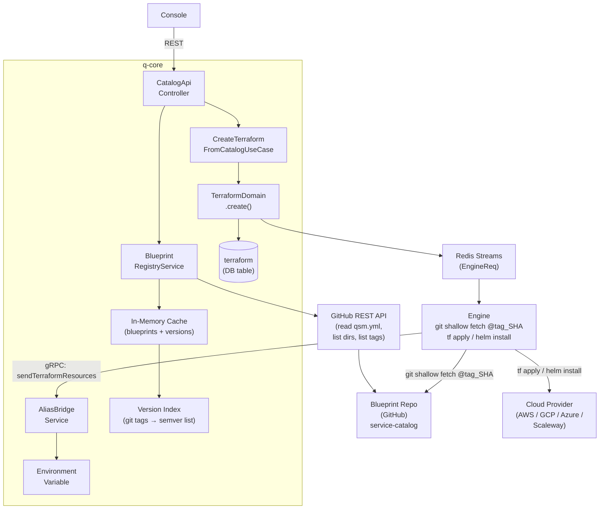
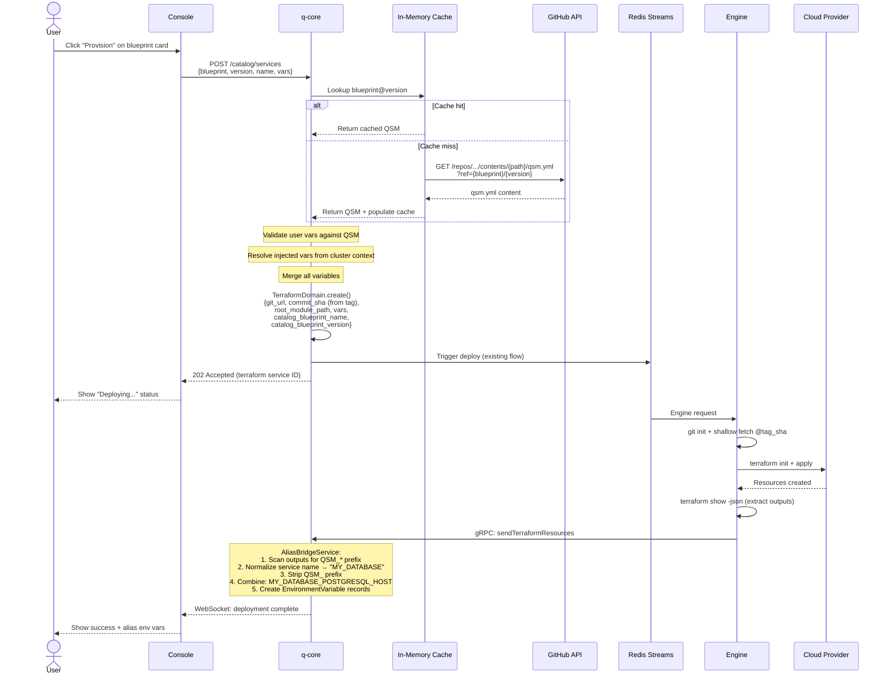
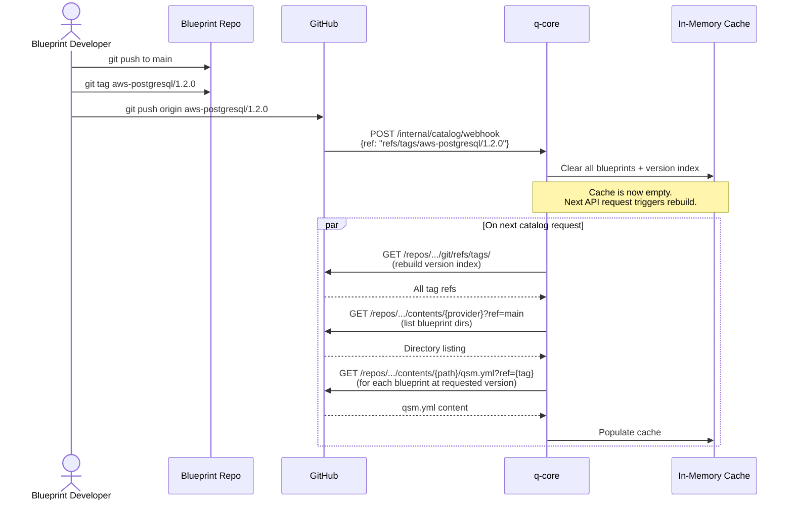

# Qovery Service Catalog -- Implementation Plan

> **Status:** Draft v4.0
> **Date:** 2026-03-12
> **Scope:** Full implementation across q-core, console, and the `service-catalog` blueprint repository. Covers MVP +
> versioning, upgrades, Helm support, and StackBlueprint composition.

---

## Table of Contents

1. [Product Decisions](#1-product-decisions)
2. [Technical Decisions](#2-technical-decisions)
3. [User Journey](#3-user-journey)
4. [Architecture & Workflow Diagrams](#4-architecture--workflow-diagrams)
5. [Versioning Mechanism](#5-versioning-mechanism)
6. [QSM Contract Specification](#6-qsm-contract-specification)
7. [Implementation Plan](#7-implementation-plan)
8. [Examples](#8-examples)
9. [Pirate Code Analysis](#9-pirate-code-analysis)

---

## 1. Product Decisions

| #  | Decision                     | Choice                                                                                                                                                                                                   | Rationale                                                                                                                                                             |
|----|------------------------------|----------------------------------------------------------------------------------------------------------------------------------------------------------------------------------------------------------|-----------------------------------------------------------------------------------------------------------------------------------------------------------------------|
| P1 | Core concept                 | The catalog is a **discovery and pre-fill layer** on top of the existing Terraform Service. A user selects a blueprint, fills variables, and q-core creates a standard Terraform Service under the hood. | Reuses the existing stack end-to-end.                                                                                                                                 |
| P3 | MVP provider scope           | 4 AWS blueprints (Redis, PostgreSQL, S3, MySQL, RabbitMQ).                                                                                                                                               | Ship fast with what's already written.                                                                                                                                |
| P4 | Dependency model             | Loose coupling via environment variables                                                                                                                                                                 | Services share data through `QSM_*` outputs -> auto-computed env vars. No enforced dependency graph. `qsm.yml` `dependencies` field is informational only (UI hints). |
| P5 | Version selection (MVP)      | Always fetch from `main` branch                                                                                                                                                                          | q-core resolves `main` to a commit SHA via GitHub API. `metadata.version` in `qsm.yml` is informational only.                                                         |
| P6 | Alias naming                 | **User selects aliases for output prefixed with QSM:** `{USER_ALIAS} -> {QSM_DB_PORT}`                                                                                                                   | Deterministic, no collisions, no user configuration needed. Service name "my-database" + output `QSM_POSTGRESQL_HOST` -> env var `MY_DATABASE_POSTGRESQL_HOST`.       |
| P7 | Provisioning UI              | **3 steps:** Name + Variables + Alias selection                                                                                                                                                          | Service name prefix doesn't work because the users would have to update their already running app.                                                                    |
| P8 | Service blueprint versioning | **Git-tag-based semver**. Tags follow `{blueprint-name}/{semver}` format (e.g., `aws-postgresql/1.2.0`). `metadata.version` in QSM must match the tag.                                                   | Enables version selection, upgrade detection, and deterministic rollback. Inspired by Kratix PromiseRelease and SpectroCloud Profile Versioning.                      |
| P9 | Version compatibility        | **Semver strict**. Minor/patch versions are backwards-compatible. Breaking changes (removed variables, renamed outputs) require a major version bump.                                                    | Predictable upgrades. Users can trust minor/patch updates won't break their services.                                                                                 |

### Out Of Scope

- Custom/private catalogs: Only the single public Qovery blueprint repo
- Helm support: Same QSM contract (variables, outputs, env vars) but backed by Helm charts instead of Terraform.
- Upgrade policy: User sets upgrade policy on each provisioned service.(**Configurable per service**: `manual` (
  default), `auto_patch`, `auto_minor`. ), What **SpectroCloud** do with version trains
- Multi-service composition: **EnvironmentBlueprint** kind. Users make their own `qsm.yml` with
  `kind: EnvironmentBlueprint` in their own Git repos, referencing multiple services in the catalog with pinned
  versions. | Users compose services declaratively. Inspired by Kratix Compound Promises and SpectroCloud Layered
  Profiles. |
-

#### Questions

- Should Alias screen be in MVP? I see a lot of values for the user as they don't have to go in the environment later
  and struggle to find & replace their vars. But it is not strictly required, what we have works for now.

---

## 2. Technical Decisions

| #   | Decision                      | Choice                                                                                | Rationale                                                                                                                                                                                           |
|-----|-------------------------------|---------------------------------------------------------------------------------------|-----------------------------------------------------------------------------------------------------------------------------------------------------------------------------------------------------|
| T1  | Blueprint repository          | Existing `service-catalog` repo (`github.com/Astach/service-catalog`)                 | Already contains 4 AWS blueprints. Add `qsm.yml` to each.                                                                                                                                           |
| T2  | Repo structure                | One directory per blueprint, flat                                                     | `aws/postgresql/`, `aws/redis/`, etc. No version subdirectories.                                                                                                                                    |
| T3  | Versioning                    | **Git tags per blueprint version**                                                    | Tag format: `{blueprint-name}/{semver}` (e.g., `aws-postgresql/1.2.0`). `main` branch is always the latest development state. Tags are immutable release snapshots.                                 |
| T4  | Output prefix                 | **`QSM_`** (Qovery Service Manifest)                                                  | The `QSM_` prefix is the sole detection mechanism for the AliasBridgeService. Any terraform service whose outputs start with `QSM_*` gets alias env vars created, regardless of how it was created. |
| T5  | q-core fetches blueprints via | **GitHub REST API**                                                                   | `GET /repos/{owner}/{repo}/contents/{path}?ref={tag}`. No cloning in q-core.                                                                                                                        |
| T6  | Caching                       | **In-memory cache** in q-core (`ConcurrentHashMap`)                                   | Dataset is tiny (~4-50 blueprints, <100KB total). Read-heavy, write-rare. Invalidated by webhook. No Redis needed for this.                                                                         |
| T7  | Cache invalidation            | GitHub webhook -> `POST /internal/catalog/webhook` -> clears in-memory cache          | Next request re-fetches from GitHub API. Admin endpoint as fallback.                                                                                                                                |
| T8  | Alias computation             | q-core receives a list of map of `Output to alias` and create the alias               
| T9  | QSM strictness                | `qsm.yml` mandatory for catalog blueprints                                            | CI validates against JSON Schema on every PR.                                                                                                                                                       |
| T11 | Version index                 | q-core builds a **version index** by listing git tags via GitHub API                  | `GET /repos/{owner}/{repo}/git/refs/tags/{blueprint-name}/` returns all versions. Parsed into a sorted semver list per blueprint. Cached alongside blueprint data.  Usefule for selecting version.  |
| T13 | Upgrade detection             | q-core compares `catalog_blueprint_version` against the version index on read         | Returns `upgrade_available: true` + `latest_version` in the Terraform Service response when applicable.                                                                                             |
| T14 | Semver compatibility CI       | CI compares `qsm.yml` against the previous minor/patch tag to detect breaking changes | On release tags, CI ensures no removed `userVariables`, no removed `outputs`, and new required variables have defaults. Major version bumps skip this check.                                        |

### Out Of Scope

| T15 | Helm engine in QSM | New `helm` section in `qsm.yml` when `engine: "helm"`. Contains chart source, release name,
namespace. | `valuePath` on variables maps flat QSM variables into Helm's nested values structure. |
| T10 | Future Helm support | The catalog layer is designed to be generic | Dedicated catalog endpoints/controller will
later serve Helm blueprints too. |
| T17 | EnvBlueprint location | **User's own Git repo**. q-core accepts a Git URL + file path pointing to a
StackBlueprint. | Keeps the catalog repo clean (ServiceBlueprints only). Users own their composition. |
| T18 | EnvBlueprint provisioning | q-core iterates services in order, creates each as a Terraform/Helm Service,
respects `dependsOn`       | Services without `dependsOn` can be created in parallel. Services with `dependsOn` wait for
their dependencies to deploy successfully. |

#### Questions

- Helm output : How to integrate them so it works like tf outputs?
- How to handle the dependency DAG for EnvBlueprint provisioning (looks like a mission for engine v2 ?!)

---

## 3. User Journey

### 3.1 Browsing the Catalog

**Steps:**

1. User navigates to an environment and opens the Service Catalog
2. The **provider filter is pre-set** to match the environment's cluster cloud provider
3. User can further filter by category and search by name/tags
4. Each card shows: icon, name, version (informational), category tag, and a "Provision" button

### 3.2 Provisioning a Service

**Steps:**

1. User clicks "Provision" on a service card
2. **Step 1:** Name the service
3. **Step 2:** Fill in user-facing variables (dynamic form from `qsm.yml`). Injected variables (cluster name, region,
   VPC, subnets) are auto-filled, and **shown first**.
4. User clicks "Provision"
5. q-core creates a standard Terraform Service with the blueprint's git_url/commit/path + merged variables
6. Deployment runs through the existing engine pipeline
7. On success, aliases are created: `MY_ALIAS` -> `QSM_POSTGRESQL_PORT`, etc.

### 3.3 Managing a Provisioned Service

After provisioning, it appears in the environment's service list as a regular **Terraform Service**.
The service is still attached to the catalog such as when a service definition is bumped, the associated services
created with this definition can be bumped as well.

### 3.6 upgrading a provisioned service

- As there isn't any notification system, we have to warn the user when he's on the service page that a new major
  version is available.
- We can auto bump path and minor version as they are additive only updates.
  **Steps:**

1. User sees "Update available" badge on a catalog-provisioned Terraform Service
2. Clicks "Review Update" to see a diff of changes between current and target version
3. Reviews new variables (pre-filled with defaults), changed defaults, new outputs
4. Clicks "Save & Redeploy" -- q-core updates the commit SHA to the new tag, merges variables, triggers redeploy
5. The alias bridge processes any new `QSM_*` outputs and creates additional env vars

### 3.8 Provisioning an Environment (Out of scope)

**Steps:**

1. User provides a Git URL + file path to their EnvBlueprint (or selects from linked repos)
2. q-core fetches and validates the EnvBlueprint
3. Console shows all services in the stack with their pre-configured variables
5. User can expand any service to customize its pre-configured defaults
6. On submit, q-core creates each service in dependency order
7. Services without dependencies are created in parallel

---

## 4. Architecture & Workflow Diagrams

### 4.1 High-Level Architecture



### 4.2 Provisioning Workflow (Sequence)



### 4.3 Blueprint Cache & Webhook Flow



## 5. Versioning Mechanism

### 5.1 Repository Layout

```
service-catalog/
+-- aws/
|   +-- postgresql/
|   |   +-- main.tf            
|   |   +-- variables.tf        
|   |   +-- outputs.tf           
|   |   +-- providers.tf          
|   |   +-- terraform.tfvars.example 
|   |   +-- README.md           
|   |   +-- qsm.yml              
|   +-- mysql/
|   |   +-- ...
|   +-- redis/
|   |   +-- ...
|   +-- mongodb/
|       +-- ... 
+-- azure/                      
+-- schemas/
|   +-- qsm-schema.json          
+-- .github/
|   +-- workflows/
|       +-- validate.yml          
|       +-- release.yml           (version tagging + compat check)
```

**Key rules:**

- One directory per blueprint (never version subdirectories)
- `main` branch is always the latest development state
- Git tags mark immutable version releases: `{blueprint-name}/{semver}`
- `metadata.version` in `qsm.yml` must match the tag version

### 5.2 Git Tag Convention

```
Tag format:    {blueprint-name}/{major}.{minor}.{patch}
Examples:      aws-postgresql/1.0.0
               aws-postgresql/1.1.0
               aws-postgresql/2.0.0
               aws-redis/1.0.0
```

**Tagging workflow:**

1. Developer updates blueprint files + bumps `metadata.version` in `qsm.yml`
2. PR is merged to `main`
3. Developer (or CI) creates a git tag matching the new version
4. CI `release.yml` validates tag matches `qsm.yml` version and runs compatibility checks
5. Webhook notifies q-core, which invalidates cache and rebuilds version index

### 5.3 Semver Compatibility Rules

| Change Type                                       | Minor/Patch Allowed?         | Major Required? |
|---------------------------------------------------|------------------------------|-----------------|
| Add new `userVariable` with default               | Yes                          | No              |
| Add new `userVariable` without default (required) | No                           | Yes             |
| Remove a `userVariable`                           | No                           | Yes             |
| Rename a `userVariable`                           | No                           | Yes             |
| Change variable `type`                            | No                           | Yes             |
| Change variable `default` value                   | Yes                          | No              |
| Add new `options` to dropdown                     | Yes                          | No              |
| Remove `options` from dropdown                    | No                           | Yes             |
| Add new `output`                                  | Yes                          | No              |
| Remove an `output`                                | No                           | Yes             |
| Rename an `output`                                | No                           | Yes             |
| Add new `injectedVariable`                        | Yes (if source is available) | No              |
| Remove `injectedVariable`                         | No                           | Yes             |
| Change `description`, `icon`, `tags`              | Yes                          | No              |
| Change `engine` or `provider`                     | No                           | Yes             |

**Auto-upgrade preconditions:**

- All new variables must have defaults (guaranteed by semver compat rules for minor/patch)
- No removed variables or outputs (guaranteed by semver compat rules)
- Service must be in a healthy state (last deploy succeeded)

---

## 6. QSM Contract Specification

### 6.1 ServiceBlueprint Schema (`kind: ServiceBlueprint`)

```yaml
# Required. Always "qovery.com/v1".
apiVersion: "qovery.com/v1"

# Required. Always "ServiceBlueprint".
kind: "ServiceBlueprint"

metadata:
  # Required. Unique name. Must match {provider}-{service} format.
  name: "aws-postgresql"
  # Required. This is what is displayed by the front.
  displayedName: "RDS Postgres"
  # Required. Semver. Must match the git tag version.
  version: "1.0.0"

  # Required. Human-readable description shown in the catalog UI.
  description: "Provision an AWS RDS PostgreSQL instance with encryption, backups, and monitoring"

  # URL to an icon image for the catalog card.
  icon: "https://cdn.qovery.com/icons/aws-rds-postgresql.svg"

  # Required. Service category. Used for filtering.
  # Allowed: "storage", "database", "cache", "messaging", "networking",
  #          "compute", "security", "monitoring", "other"
  categories: [ "database", "storage" ]

  # Required. Used for filtering.
  provider: "aws"

spec:
  # Required. IaC engine.
  # Allowed: "terraform", "opentofu", "helm"
  engine: "terraform"

  # Variables auto-filled by q-core from environment/cluster context.
  injectedVariables:
    - name: "qovery_cluster_name"
      source: "cluster.name"
    - name: "region"
      source: "cluster.region"

  # Variables shown to the user in the provisioning form.
  userVariables:
    - name: "instance_class"
      type: "string"
      required: false
      default: "db.t3.micro"
      description: "RDS instance class"
      options:
        - "db.t3.micro"
        - "db.t3.small"
        - # Outputs produced after apply/install.
        # Names MUST start with "QSM_" prefix.
  outputs:
    - name: "QSM_POSTGRESQL_HOST"
      description: "Database hostname"
      sensitive: false
```

### 6.3 StackBlueprint Schema (`kind: StackBlueprint`)

EnvBlueprints live in user Git repos, not in the catalog repo. They compose multiple catalog ServiceBlueprints.

```yaml
apiVersion: "qovery.com/v1"
kind: "StackBlueprint"

metadata:
  name: "production-stack"
  version: "1.0.0"
  description: "Production environment with PostgreSQL, Redis, and monitoring"
  tags:
    - "production"
    - "full-stack"

spec:
  # Required. List of services to provision.
  services:
    - blueprint: "aws-postgresql"
      # Version constraint. Resolved to the latest matching version.
      # Exact: "1.2.0", Range: ">=1.1.0 <2.0.0", Train: "1.x"
      version: "1.2.0"
      # Required. Becomes the service name and env var prefix.
      alias: "main-db"
      # Optional. Pre-configured variable values.
      # Variables not listed here will be prompted to the user.
      variables:
        instance_class: "db.r6g.large"
        multi_az: "true"
        disk_size: "100"
        database_name: "production"
      # Optional. Services this depends on (must complete first).
      dependsOn: [ ]

    - blueprint: "aws-redis"
      version: "1.x"           # Version train: latest 1.x release
      alias: "cache"
      variables:
        node_type: "cache.r6g.large"
        num_cache_clusters: "2"
      dependsOn: [ ]

    - blueprint: "aws-postgresql"
      version: ">=1.1.0 <2.0.0"  # Version constraint
      alias: "analytics-db"
      variables:
        instance_class: "db.t3.medium"
        database_name: "analytics"
      dependsOn: [ "main-db" ]    # Wait for main-db to be provisioned first
```

**StackBlueprint rules:**

1. Each service entry must reference a valid `blueprint` name from the catalog
2. `alias` must be unique within the stack (it becomes the Qovery service name)
3. `version` supports three formats:
    - Exact: `"1.2.0"` -- resolves to exactly that version
    - Train: `"1.x"` -- resolves to the latest `1.*.*` release
    - Constraint: `">=1.1.0 <2.0.0"` -- resolves to the latest version matching the constraint
4. `variables` map pre-fills variable values. Required variables not listed here are prompted to the user.
5. `dependsOn` declares ordering constraints. Services without `dependsOn` can be provisioned in parallel.
6. The same `blueprint` can appear multiple times with different `alias` names (e.g., two PostgreSQL instances).
7. All services in the stack are created in the same Qovery environment.

**Variable resolution order (highest priority wins):**

1. User input at provisioning time (overrides everything)
2. `variables` map in the StackBlueprint service entry
3. `default` value from the ServiceBlueprint's `userVariables`
4. `injectedVariables` from cluster context (always applied, never overridden)

### 6.4 Injected Variable Sources

q-core resolves `injectedVariables[].source` from the cluster/environment context:

| Source                       | Resolved From                               |
|------------------------------|---------------------------------------------|
| `cluster.name`               | `KubernetesProvider.name`                   |
| `cluster.region`             | `CloudProviderRegion` of the cluster        |
| `cluster.vpc_id`             | `InfrastructureOutputs.vpcId` (EKS/GKE/AKS) |
| `cluster.subnet_ids`         | `InfrastructureOutputs.subnetIds`           |
| `cluster.security_group_ids` | `InfrastructureOutputs.securityGroupIds`    |
| `environment.id`             | `Environment.id`                            |
| `project.id`                 | `Project.id`                                |
| `organization.id`            | `Organization.id`                           |

### 6.5 Validation Rules (enforced by CI)

| Rule                                                              | Where                           |
|-------------------------------------------------------------------|---------------------------------|
| `qsm.yml` passes JSON Schema validation                           | PR CI                           |
| `metadata.name` matches `{provider}-{directory-name}`             | PR CI                           |
| All `injectedVariables[].name` exist in `variables.tf`            | PR CI (Terraform/OpenTofu only) |
| All `injectedVariables[].source` are valid source paths           | PR CI                           |
| All `userVariables[].name` exist in `variables.tf`                | PR CI (Terraform/OpenTofu only) |
| All `outputs[].name` start with `QSM_`                            | PR CI                           |
| All `outputs[].name` exist as `output` blocks in `*.tf`           | PR CI (Terraform/OpenTofu only) |
| `terraform init && terraform validate` passes                     | PR CI (Terraform/OpenTofu only) |
| `metadata.version` matches git tag version                        | Release CI                      |
| Minor/patch version is backwards-compatible                       | Release CI                      |
| Helm `valuePath` references are syntactically valid               | PR CI (Helm only)               |
| Helm `outputs[].source` follows `configmap:` or `service:` format | PR CI (Helm only)               |

---

#### From SpectroCloud

| Idea                                                      | How We Apply It                                                                                     |
|-----------------------------------------------------------|-----------------------------------------------------------------------------------------------------|
| **Profile versioning** (`major.minor.patch`)              | Explicit semver on blueprints, enforced by git tags and CI.                                         |
| **Version trains** (`1.x` auto-resolves to latest minor)  | EnvBlueprints support `version: "1.x"` -- resolves to the latest 1.*.* release.                     |
| **Layered profiles** (infrastructure + add-on separation) | StackBlueprint layers services like SpectroCloud layers packs. Each service is a versioned "layer." |
| **Helm charts as first-class layers**                     | `engine: "helm"` with full chart specification in the `helm` section.                               |
| **Upgrade notification on clusters**                      | "Update available" badge on catalog-provisioned services, with configurable auto-upgrade policy.    |

#### From Pulumi

| Idea                                                               | How We Apply It                                                                                                                             |
|--------------------------------------------------------------------|---------------------------------------------------------------------------------------------------------------------------------------------|
| **Package semver for distribution**                                | Blueprint versions follow semver. Consumers (EnvBlueprints, users) pin or constrain versions.                                               |
| **Component Resources** (group related resources under one parent) | StackBlueprint groups multiple services under one logical stack.                                                                            |
| **Cross-stack references via outputs**                             | Already solved by the `QSM_*` env var bridge -- environment-scoped variables enable cross-service data sharing without explicit references. |
| **Version constraints** (>=, <, ~)                                 | StackBlueprint `services[].version` supports range constraints.                                                                             |

#### From Cortex

| Idea                                           | How We Apply It                                                                                                   |
|------------------------------------------------|-------------------------------------------------------------------------------------------------------------------|
| **Scorecards** (compliance checks on entities) | Future: "Blueprint Scorecard" -- does it follow best practices? Encryption enabled? Multi-AZ? Backups configured? |
| **Typed relationships between entities**       | Functional `dependencies` with version constraints between blueprints.                                            |
| **GitOps as source of truth**                  | Already in place -- blueprints live in Git, versions are git tags, webhooks sync state.                           |
