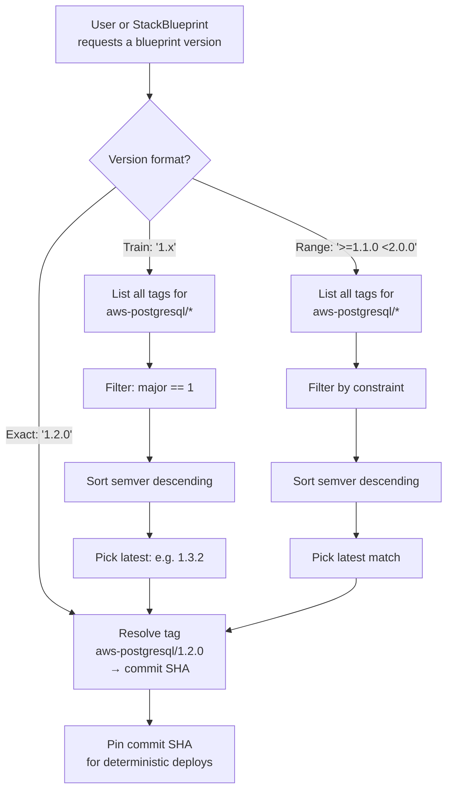
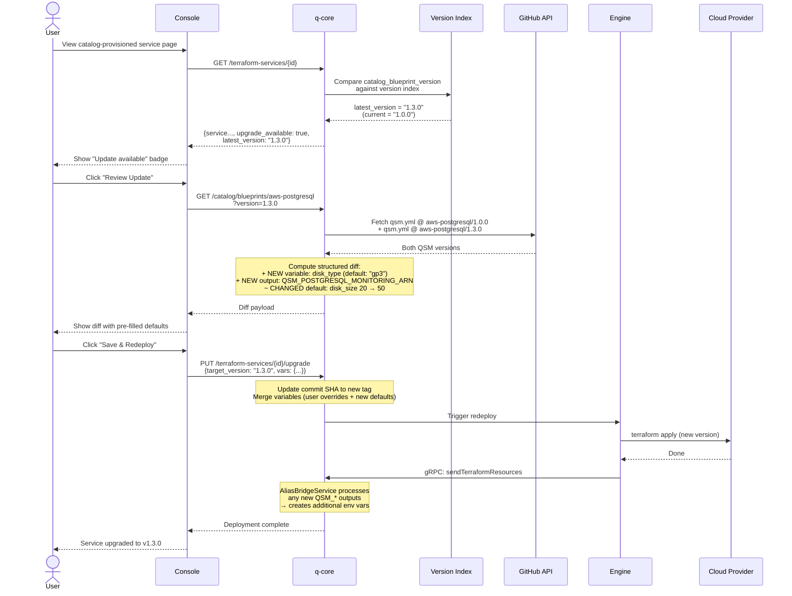
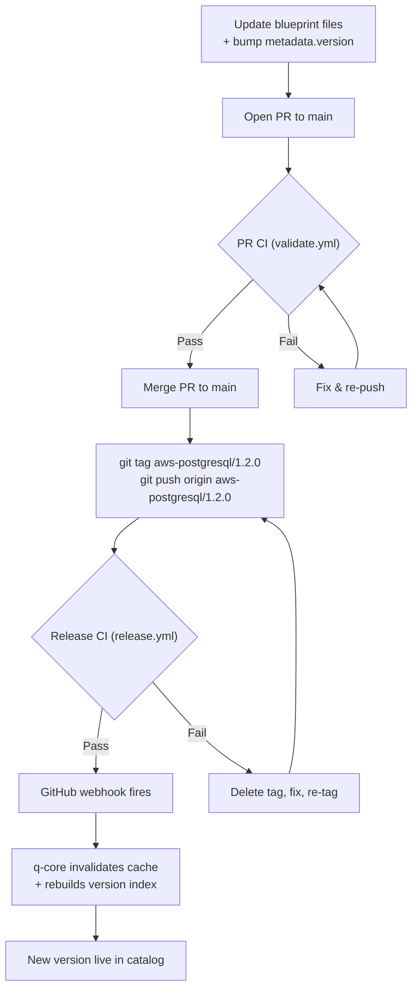
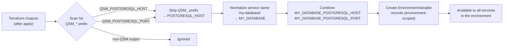

# Qovery Service Catalog

Pre-built infrastructure blueprints for provisioning cloud resources through the Qovery platform. Supports Terraform, OpenTofu, and Helm engines.

## Repository Structure

```
service-catalog/
├── aws/
│   ├── postgresql/    # AWS RDS PostgreSQL
│   ├── mysql/         # AWS RDS MySQL
│   ├── redis/         # AWS ElastiCache Redis
│   └── mongodb/       # AWS DocumentDB (MongoDB-compatible)
├── gcp/               # (future)
├── azure/             # (future)
├── schemas/
│   └── qsm-schema.json   # JSON Schema for qsm.yml validation
└── .github/
    └── workflows/
        ├── validate.yml   # PR CI: schema + terraform validation
        └── release.yml    # Release CI: tag validation + compat check
```

Each blueprint directory contains:

| File           | Description                    |
| -------------- | ------------------------------ |
| `main.tf`      | Terraform resources            |
| `variables.tf` | Input variables                |
| `outputs.tf`   | Outputs (prefixed with `QSM_`) |
| `providers.tf` | Provider configuration         |
| `qsm.yml`      | Qovery Service Manifest        |
| `README.md`    | Blueprint documentation        |

## QSM (Qovery Service Manifest)

Every blueprint requires a `qsm.yml` file that describes the blueprint for the catalog. Key sections:

- **metadata**: name, version, description, tags
- **spec.provider**: Cloud provider (aws, gcp, azure, scaleway, ...)
- **spec.engine**: IaC engine (terraform, opentofu, helm)
- **spec.injectedVariables**: Variables auto-filled from cluster/environment context (hidden from user)
- **spec.userVariables**: Variables shown in the provisioning form
- **spec.outputs**: Outputs exposed as environment variables
- **spec.helm**: Helm chart configuration (required when engine is `helm`)

See `schemas/qsm-schema.json` for the full schema.

---

## Versioning

Blueprints follow **semantic versioning** (semver) enforced through **git tags**. Each version is an immutable snapshot of a blueprint at a specific commit.

### Git Tag Convention

```
Format:    {blueprint-name}/{major}.{minor}.{patch}

Examples:  aws-postgresql/1.0.0
           aws-postgresql/1.1.0
           aws-postgresql/2.0.0
           aws-redis/1.0.0
```

- The `main` branch is always the latest development state.
- Git tags mark immutable release snapshots.
- `metadata.version` in `qsm.yml` **must match** the git tag version.

### Version Pinning

When provisioning a service from the catalog, users select a specific version. q-core resolves the git tag to a commit SHA for deterministic deployments.

**At provisioning time:**

```
User selects "aws-postgresql v1.2.0"
  -> q-core resolves tag "aws-postgresql/1.2.0" to commit SHA abc123
  -> Terraform Service is created with commit_sha=abc123
  -> All future redeploys use the same SHA until upgraded
```

**In EnvBlueprints** (multi-service composition files), version pinning supports three formats:

| Format    | Example            | Behavior                                                                       |
| --------- | ------------------ | ------------------------------------------------------------------------------ |
| **Exact** | `"1.2.0"`          | Resolves to exactly version 1.2.0. Fully deterministic.                        |
| **Train** | `"1.x"`            | Resolves to the latest `1.*.*` release. Auto-follows minor/patch within major. |
| **Range** | `">=1.1.0 <2.0.0"` | Resolves to the latest version matching the constraint.                        |



Example StackBlueprint with version pinning:

```yaml
apiVersion: "qovery.com/v1"
kind: "StackBlueprint"
metadata:
  name: "my-stack"
  version: "1.0.0"
  description: "Production environment"
spec:
  services:
    - blueprint: "aws-postgresql"
      version: "1.2.0" # Exact pin -- always 1.2.0
      alias: "main-db"

    - blueprint: "aws-redis"
      version: "1.x" # Train -- latest 1.x.x release
      alias: "cache"

    - blueprint: "aws-postgresql"
      version: ">=1.1.0 <2.0.0" # Range -- latest within bounds
      alias: "analytics-db"
```

### Semver Compatibility Rules

Versioning follows **strict semver**. Minor and patch versions are guaranteed backwards-compatible. Breaking changes require a major version bump.

| Change                                     | Minor/Patch OK? | Major Required? |
| ------------------------------------------ | --------------- | --------------- |
| Add new `userVariable` **with** default    | Yes             | No              |
| Add new `userVariable` **without** default | No              | Yes             |
| Remove a `userVariable`                    | No              | Yes             |
| Rename a `userVariable`                    | No              | Yes             |
| Change variable `type`                     | No              | Yes             |
| Change variable `default` value            | Yes             | No              |
| Add new `options` to a dropdown            | Yes             | No              |
| Remove `options` from a dropdown           | No              | Yes             |
| Add new `output`                           | Yes             | No              |
| Remove an `output`                         | No              | Yes             |
| Rename an `output`                         | No              | Yes             |
| Add new `injectedVariable`                 | Yes             | No              |
| Remove an `injectedVariable`               | No              | Yes             |
| Change `description`, `icon`, `tags`       | Yes             | No              |
| Change `engine` or `provider`              | No              | Yes             |

**Why this matters:** When a user upgrades from v1.0.0 to v1.3.0, they can trust that:

- All their existing variables still work
- All their existing env vars (from outputs) still exist
- New variables have defaults, so no manual input is needed for auto-upgrades
- No surprises -- the upgrade is additive only

### Upgrade Flow

When a new version of a blueprint is released, users with services provisioned from that blueprint are notified.

**How it works:**

1. q-core tracks which blueprint and version each service was created from (`catalog_blueprint_name` + `catalog_blueprint_version` on the Terraform Service).
2. When the service is fetched, q-core checks the version index and returns `upgrade_available: true` + `latest_version` if a newer version exists.
3. The Console shows an "Update available" badge on the service.
4. User clicks "Review Update" and sees a structured diff:
   - New variables added (with defaults pre-filled)
   - Changed defaults
   - New options added to dropdowns
   - New outputs that will produce new env vars
5. User confirms, q-core updates the commit SHA to the new tag and triggers a redeploy.



**Upgrade diff example (v1.0.0 -> v1.2.0):**

```
+ NEW variable: disk_type (string, default: "gp3")
+ NEW variable: monitoring_interval (number, default: 60)
+ NEW output: QSM_POSTGRESQL_MONITORING_ARN
~ CHANGED default: disk_size 20 -> 50
~ CHANGED options: instance_class added "db.r7g.large"
```

### Upgrade Policies

Each provisioned service has a configurable upgrade policy:

| Policy             | Behavior                                                        | Use Case                                             |
| ------------------ | --------------------------------------------------------------- | ---------------------------------------------------- |
| `manual` (default) | Notification only. User must review and confirm.                | Production databases, critical infrastructure.       |
| `auto_patch`       | Auto-applies `x.y.Z` bumps (1.0.0 -> 1.0.3). Skips minor/major. | Services where bug fixes should be immediate.        |
| `auto_minor`       | Auto-applies `x.Y.z` bumps (1.0.0 -> 1.3.0). Skips major.       | Services that should get new features automatically. |

**All policies skip major version bumps** -- those always require manual review because they may contain breaking changes.

**Auto-upgrade preconditions:**

- All new variables must have defaults (guaranteed by semver rules for minor/patch)
- No removed variables or outputs (guaranteed by semver rules)
- Service must be in a healthy state (last deploy succeeded)
- q-core runs a periodic check (every 15 min) for services with non-manual policies

### Release Workflow

To release a new version of a blueprint:

1. Update the blueprint files (Terraform, `qsm.yml`, etc.)
2. Bump `metadata.version` in `qsm.yml` to the new version
3. Open a PR to `main` -- CI validates schema, variables, outputs, and runs `terraform validate`
4. Merge the PR
5. Create a git tag matching the new version:

```bash
# Tag the current main HEAD
git tag aws-postgresql/1.2.0
git push origin aws-postgresql/1.2.0
```

6. Release CI (`release.yml`) validates:
   - Tag version matches `metadata.version` in `qsm.yml`
   - Minor/patch versions are backwards-compatible with the previous version (no removed vars/outputs, new required vars have defaults)
   - Major version bumps skip the compatibility check
7. GitHub webhook notifies q-core, which invalidates cache and rebuilds the version index



### Out of scope

Notification system for available service update

---

## Helm Blueprints

Blueprints can use Helm as the engine instead of Terraform. The user experience is identical (browse catalog, fill variables, get env vars), but the underlying provisioning uses `helm install` instead of `terraform apply`.

### Helm QSM Structure

```yaml
apiVersion: "qovery.com/v1"
kind: "ServiceBlueprint"
metadata:
  name: "k8s-prometheus"
  version: "1.0.0"
  description: "Prometheus monitoring stack"
spec:
  provider: "aws"
  category: "monitoring"
  engine: "helm"

  helm:
    chart:
      repository: "https://prometheus-community.github.io/helm-charts"
      name: "kube-prometheus-stack"
      version: "58.2.1"
    namespace: "monitoring"
    timeout: 600

  userVariables:
    - name: "retention_days"
      type: "number"
      default: "15"
      description: "Data retention in days"
      required: false
      uiHint: "text"
      valuePath: "prometheus.prometheusSpec.retention"

  outputs:
    - name: "QSM_PROMETHEUS_URL"
      description: "Prometheus server URL"
      sensitive: false
      source: "service:monitoring/prometheus-server:9090"
```

Key differences from Terraform blueprints:

- `spec.helm` section is required (chart repo, name, version)
- Variables use `valuePath` to map into Helm's nested `values.yaml` (e.g., `prometheus.prometheusSpec.retention`)
- Outputs specify a `source` for value extraction: `configmap:{ns}/{name}:{key}` or `service:{ns}/{name}:{port}`

---

## EnvBlueprints (Multi-Service Composition)

Users can compose multiple catalog services into a single deployable stack by authoring a `StackBlueprint` in their own Git repos.

```yaml
apiVersion: "qovery.com/v1"
kind: "StackBlueprint"
metadata:
  name: "production-stack"
  version: "1.0.0"
  description: "Production environment with database, cache, and monitoring"
spec:
  services:
    - blueprint: "aws-postgresql"
      version: "1.2.0" # Exact version pin
      alias: "main-db"
      variables:
        instance_class: "db.r6g.large"
        multi_az: "true"

    - blueprint: "aws-redis"
      version: "1.x" # Version train
      alias: "cache"
      variables:
        node_type: "cache.r6g.large"

    - blueprint: "aws-postgresql"
      version: ">=1.1.0 <2.0.0" # Version range
      alias: "analytics-db"
      variables:
        instance_class: "db.t3.medium"
      dependsOn: ["main-db"] # Wait for main-db first
```

- `alias` becomes the service name in Qovery (must be unique within the stack)
- `variables` pre-fill values; remaining required variables are prompted at provisioning time
- `dependsOn` controls ordering; services without it deploy in parallel
- The same blueprint can appear multiple times with different aliases
- EnvBlueprints live in user repos, not in this catalog repo

---

## Alias Variable Mechanism

Catalog services use an automatic alias bridge to expose outputs as environment variables to other services in the same environment.

### How it works

1. Every output in a blueprint **must** be prefixed with `QSM_` (Qovery Service Manifest), e.g. `QSM_POSTGRESQL_HOST`.
2. The user is asked to enter alias (if they want for every QSM\_ found)
3. After apply/install, q-core reads the outputs and creates the aliases

4. These environment variables are created at **environment scope**, so every other service in the environment can read them.



### Example

A user provisions the `aws-postgresql` blueprint and names the service `my-database`.

| Output                             | Environment variable                       |
| ---------------------------------- | ------------------------------------------ |
| `QSM_POSTGRESQL_HOST`              | `MY_DATABASE_POSTGRESQL_HOST`              |
| `QSM_POSTGRESQL_PORT`              | `MY_DATABASE_POSTGRESQL_PORT`              |
| `QSM_POSTGRESQL_DATABASE`          | `MY_DATABASE_POSTGRESQL_DATABASE`          |
| `QSM_POSTGRESQL_USERNAME`          | `MY_DATABASE_POSTGRESQL_USERNAME`          |
| `QSM_POSTGRESQL_CONNECTION_STRING` | `MY_DATABASE_POSTGRESQL_CONNECTION_STRING` |

The service name is normalized: lowercased with hyphens/spaces replaced by underscores, then uppercased (`my-database` -> `MY_DATABASE`).
**We must check that the alias doens't exist yet**

### Rules for blueprint authors

- All output names **must** start with `QSM_` (enforced by CI and JSON Schema).
- The part after `QSM_` should identify the service type (`POSTGRESQL_`, `MYSQL_`, `REDIS_`, `MONGODB_`).
- Aliases are **user-editable**.
- Sensitive outputs should be marked with `sensitive: true` in `qsm.yml` and will be stored as secrets.

---

## Contributing

### Adding or Updating a Blueprint

1. Create or modify a blueprint in the appropriate `{provider}/{service}/` directory
2. Ensure `qsm.yml` is valid against the JSON Schema
3. All variables referenced in `qsm.yml` must exist in `variables.tf`
4. All outputs referenced in `qsm.yml` must exist in `outputs.tf` and start with `QSM_`
5. Run `terraform init -backend=false && terraform validate` locally
6. Open a PR -- CI validates everything automatically

### Releasing a New Version

1. Update the blueprint and bump `metadata.version` in `qsm.yml`
2. Merge the PR to `main`
3. Tag and push:

```bash
git tag aws-postgresql/1.2.0
git push origin aws-postgresql/1.2.0
```

1. Release CI validates the tag, checks backwards compatibility for minor/patch bumps

### Version Bump Guidelines

- **Patch** (1.0.0 -> 1.0.1): Bug fixes, documentation updates, no variable/output changes
- **Minor** (1.0.0 -> 1.1.0): New variables (with defaults), new outputs, new options added to dropdowns
- **Major** (1.0.0 -> 2.0.0): Removed/renamed variables or outputs, changed variable types, removed dropdown options
