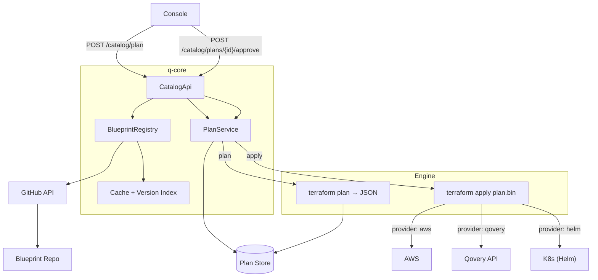
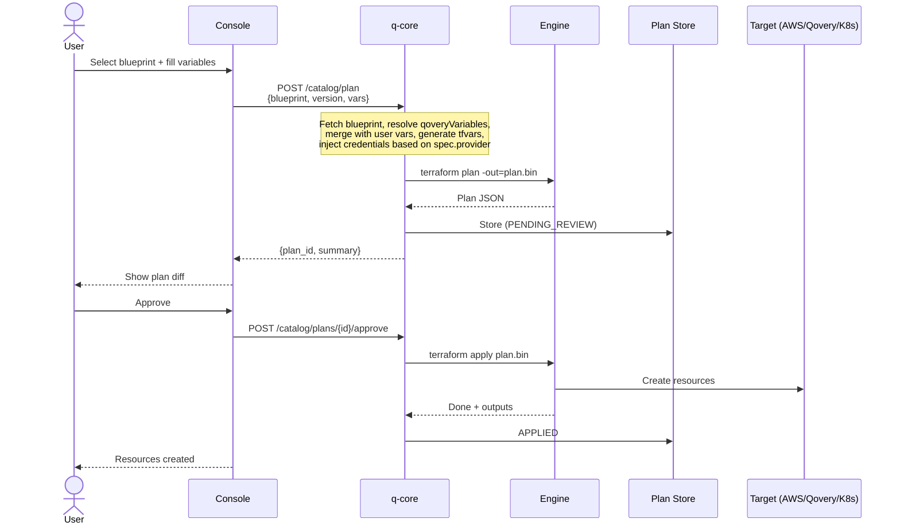
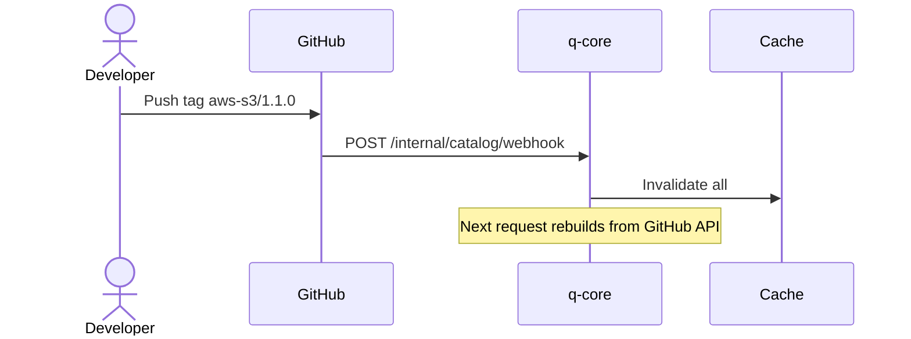
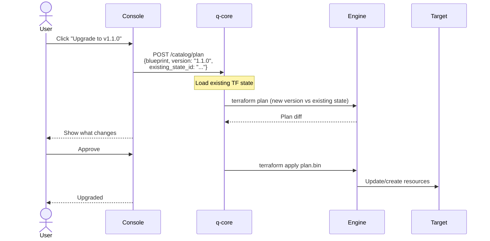
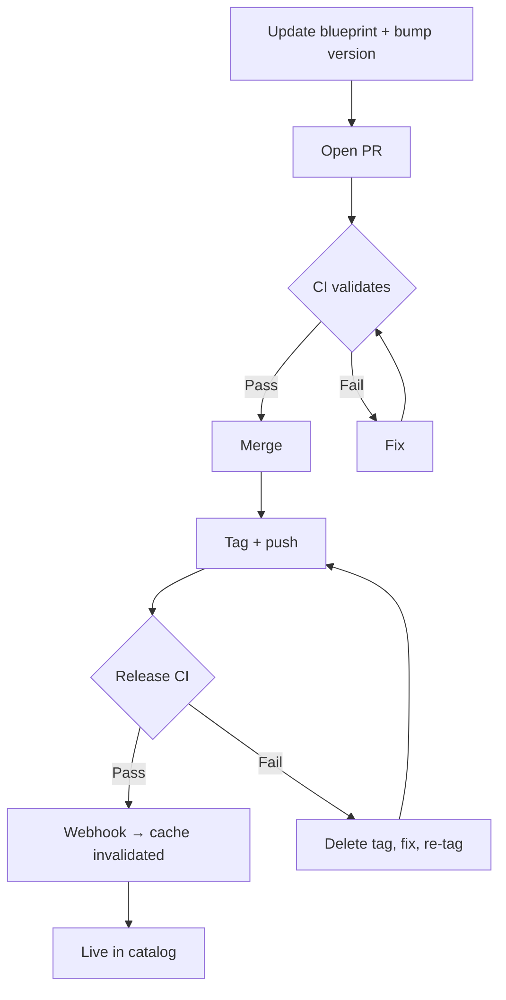
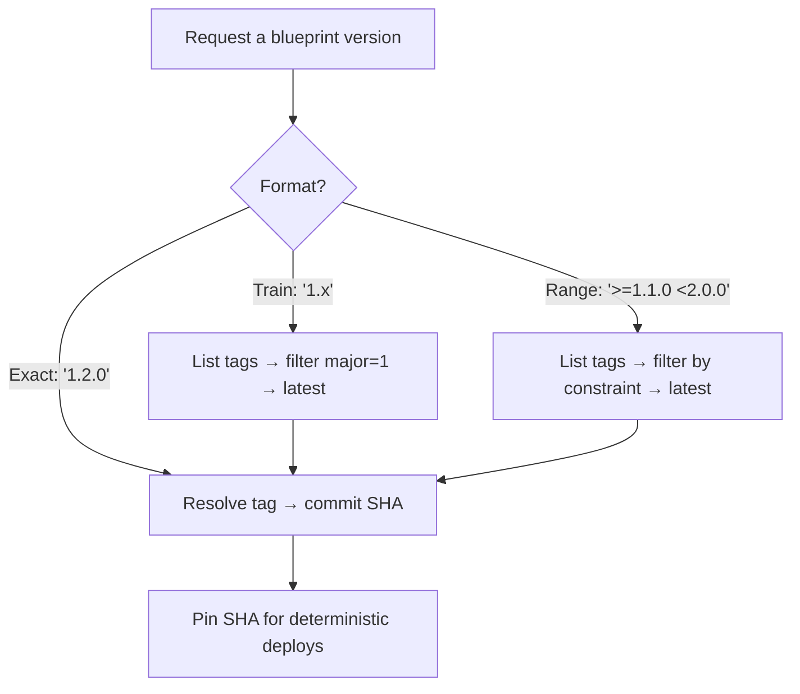
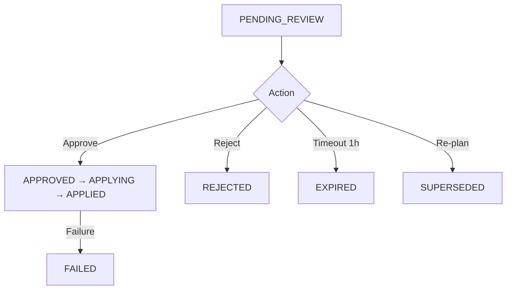
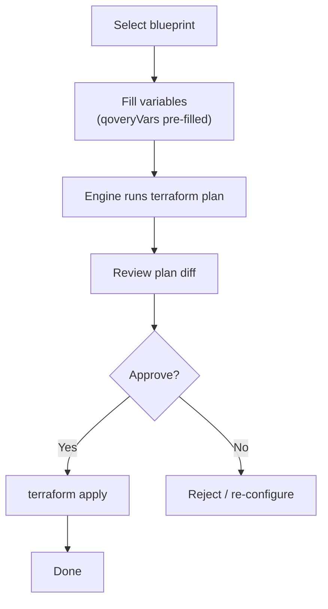
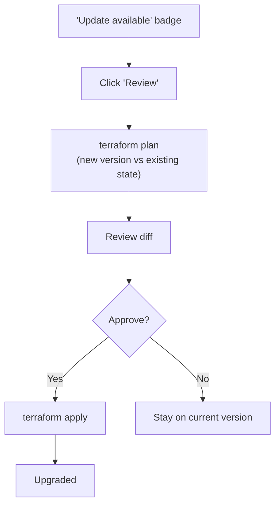
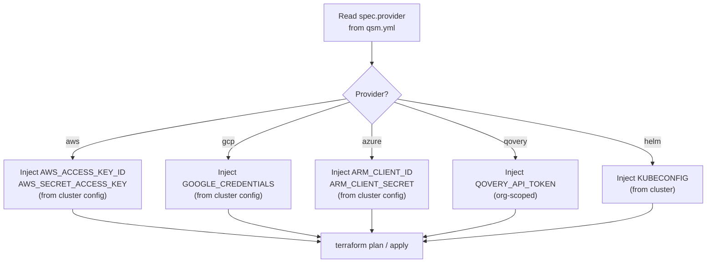

# Service Catalog -- Mermaid Diagrams

---

## 1. High-Level Architecture

---

## 2. Provisioning Sequence

---

## 3. Cache & Webhook

---

## 4. Upgrade Flow

---

## 5. Release Workflow

---

## 6. Version Resolution

---

## 7. Plan States

---

## 8. User Journey -- Provision

---

## 9. User Journey -- Upgrade

---

## 10. Credential Injection

