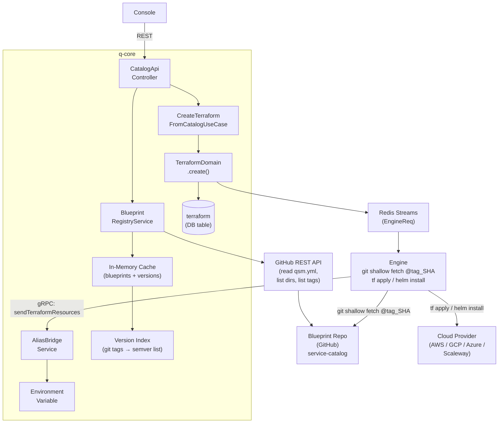
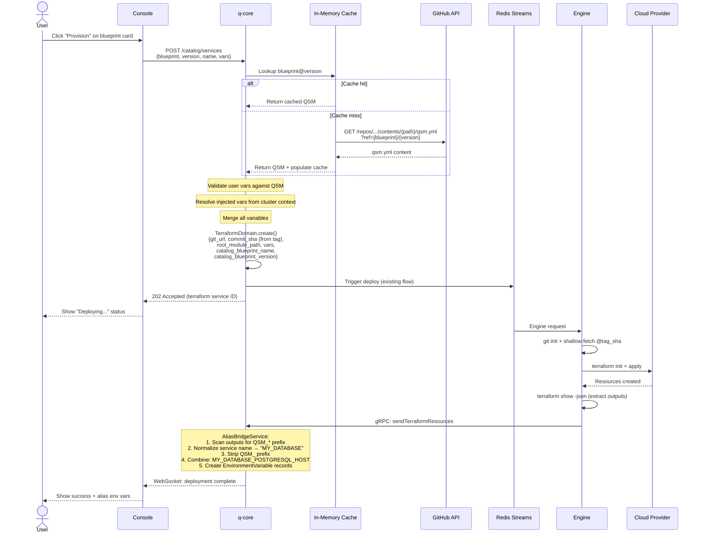
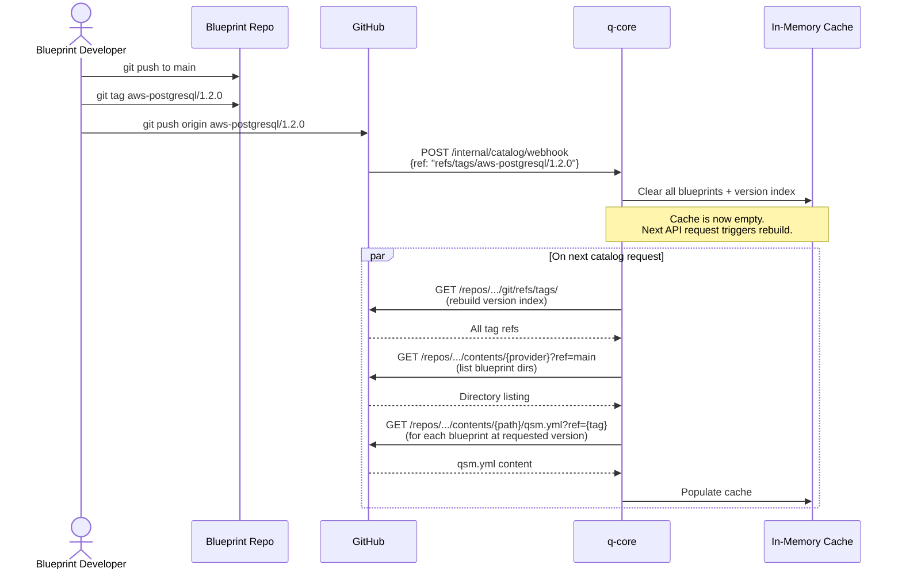
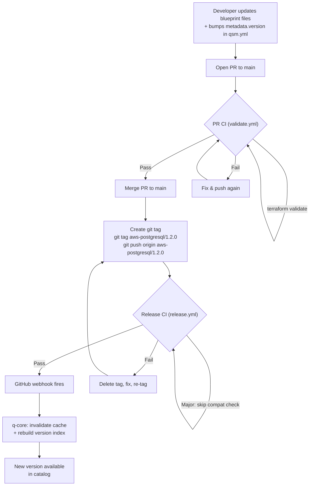
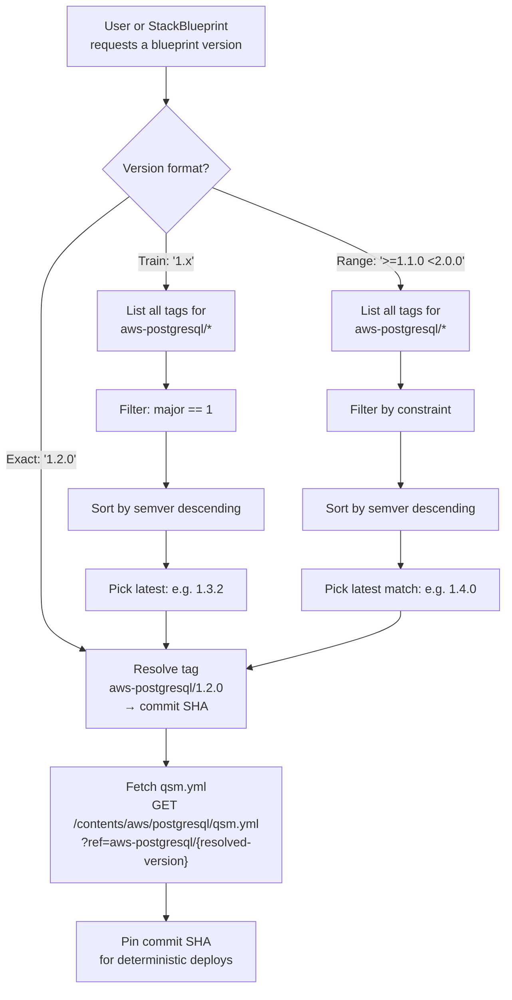
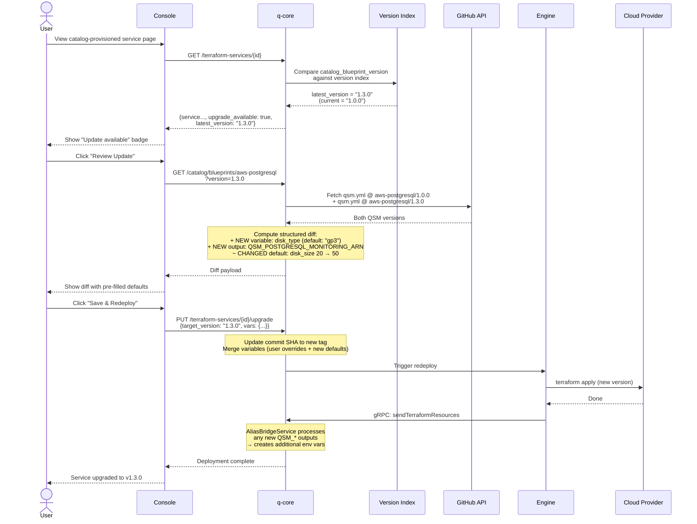
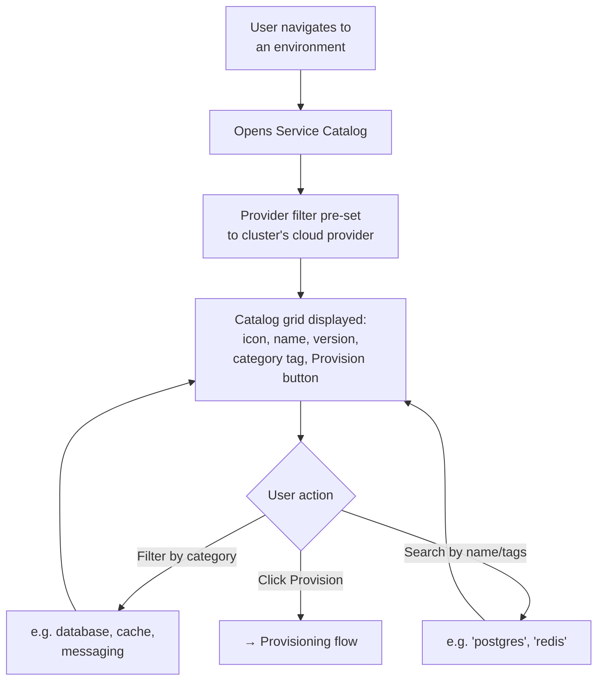
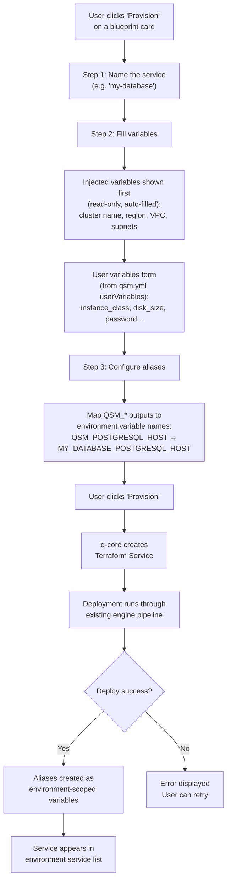
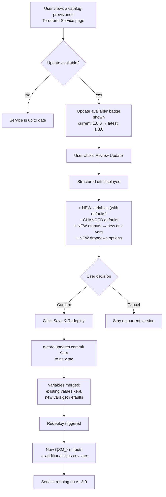
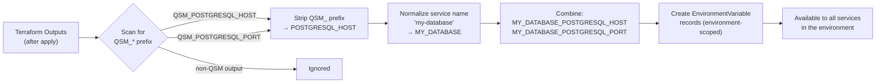

# Service Catalog -- Mermaid Diagrams

All workflows, architecture, and user journeys for the Qovery Service Catalog.

---

## 1. High-Level Architecture



---

## 2. Provisioning Workflow (Sequence)



---

## 3. Blueprint Cache & Webhook Flow



---

## 4. Release Workflow (Developer → Production)



---

## 5. Version Resolution Flow



---

## 6. Upgrade Flow



---

## 7. Auto-Upgrade Policy Flow

```mermaid
flowchart TD
    A["q-core periodic check<br/>(every 15 min)"] --> B["List all catalog-provisioned<br/>Terraform Services"]
    B --> C{"Upgrade policy?"}

    C -->|manual| D["Skip<br/>(user handles it)"]

    C -->|auto_patch| E["Check version index<br/>for newer patch"]
    E --> F{"New x.y.Z available?"}
    F -->|No| G["No action"]
    F -->|Yes| H{"Service healthy?<br/>(last deploy succeeded)"}
    H -->|No| I["Skip, wait for healthy state"]
    H -->|Yes| J["Auto-upgrade:<br/>update SHA + redeploy"]

    C -->|auto_minor| K["Check version index<br/>for newer minor/patch"]
    K --> L{"New x.Y.z available?"}
    L -->|No| G
    L -->|Yes| M{"Service healthy?"}
    M -->|No| I
    M -->|Yes| J

    Note over J: Major bumps are NEVER<br/>auto-applied regardless<br/>of policy
```

---

## 8. User Journey -- Browse Catalog



---

## 9. User Journey -- Provision a Service



---

## 10. User Journey -- Upgrade a Service



---

## 11. Alias Bridge Mechanism


