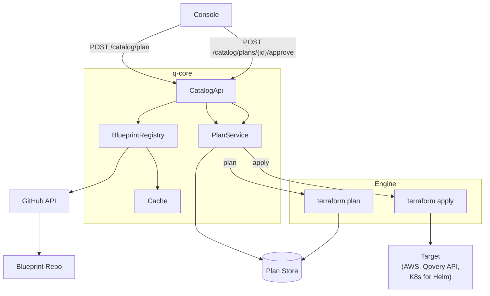
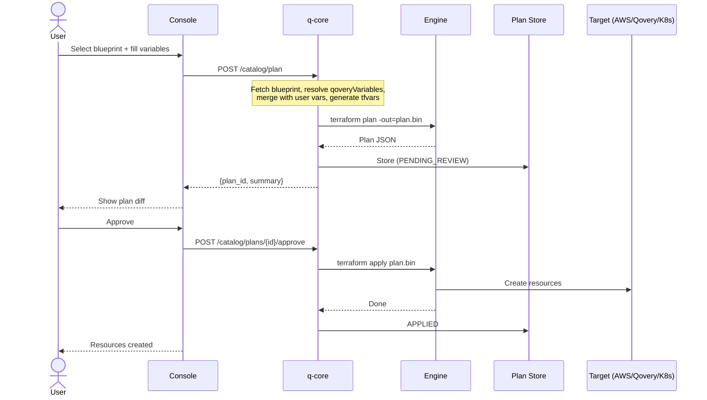
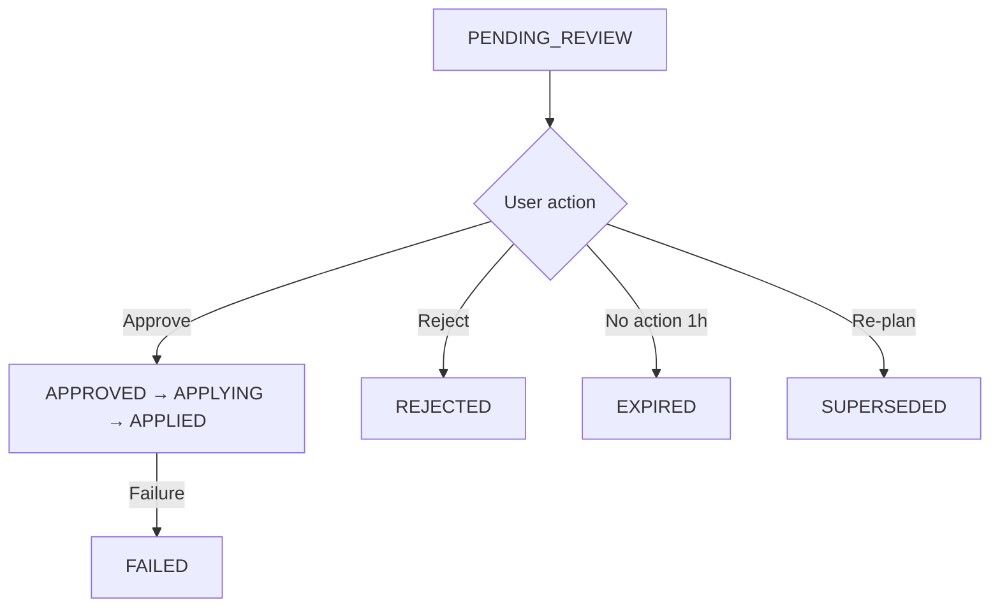

# Service Catalog -- Design

> **Date:** 2026-03-17

---

## Overview

Blueprints are standard Terraform modules with a `qsm.yml` manifest. `spec.provider` determines which credentials the engine injects (AWS, GCP, Qovery, Helm, etc.). All blueprints follow the same plan → review → approve → apply workflow.

---

## Architecture



### Credential Injection

The engine reads `spec.provider` from the QSM and injects the appropriate credentials before running Terraform:

| `spec.provider` | Injected credentials |
|---|---|
| `aws` | `AWS_ACCESS_KEY_ID`, `AWS_SECRET_ACCESS_KEY` (from cluster config) |
| `gcp` | `GOOGLE_CREDENTIALS` (from cluster config) |
| `azure` | `ARM_CLIENT_ID`, `ARM_CLIENT_SECRET`, etc. (from cluster config) |
| `qovery` | `QOVERY_API_TOKEN` (org-scoped) |
| `helm` | `KUBECONFIG` (from cluster) |

For StackBlueprints with mixed providers, the engine injects all needed credentials.

---

## Workflow

```
1. BROWSE    → User selects a blueprint
2. CONFIGURE → User fills in variables (qoveryVariables pre-filled)
3. PLAN      → Engine runs terraform plan, stores JSON + binary planfile
4. REVIEW    → User sees what will be created/changed/destroyed
5. APPROVE   → User approves
6. APPLY     → Engine runs terraform apply plan.bin
7. DONE      → Resources created, service tracked in catalog DB
```

### Provisioning Sequence



### Plan States



---

## Plan Object

| Field | Type | Description |
|-------|------|-------------|
| `id` | UUID | Plan identifier |
| `blueprint_name` | String | e.g. `aws-s3` |
| `blueprint_version` | String | e.g. `1.0.0` |
| `environment_id` | UUID | Target environment |
| `variables` | JSON | User-provided values |
| `plan_json` | JSON | `terraform show -json` output |
| `plan_binary` | Blob | Binary planfile for exact apply |
| `status` | Enum | `PENDING_REVIEW`, `APPROVED`, `APPLYING`, `APPLIED`, `REJECTED`, `EXPIRED`, `FAILED`, `SUPERSEDED` |
| `created_at` | Timestamp | |
| `expires_at` | Timestamp | Auto-expire after 1h |
| `terraform_state_id` | UUID | TF state reference (for upgrades) |

---

## QSM Spec

### ServiceBlueprint

```yaml
apiVersion: "qovery.com/v2"
kind: ServiceBlueprint

metadata:
  name: "aws-s3"
  version: "1.0.0"
  description: "S3 bucket"

spec:
  provider: "aws"          # credential selector
  qoveryVariables:
    - name: "region"
      source: "cluster.region"
      overridable: true

  userVariables:
    - name: "bucket_name"
      type: "string"
      required: true

  outputs:
    - name: "bucket_arn"
      sensitive: false
```

### StackBlueprint

A StackBlueprint composes existing ServiceBlueprints. No Terraform files -- just orchestration.

```yaml
apiVersion: "qovery.com/v2"
kind: StackBlueprint

metadata:
  name: "production-stack"
  version: "1.0.0"
  categories: ["stack", "database", "cache"]

spec:
  stages:
    - name: "databases"
      services:
        - blueprint: "aws-postgresql"
          version: ">=1.0.0 <2.0.0"
          alias: "main-db"
          variables:
            instance_class: "db.r6g.large"
        - blueprint: "aws-redis"
          version: "1.x"
          alias: "cache"
    - name: "applications"
      services:
        - blueprint: "container-app"
          version: "1.0.0"
          alias: "api"
```

- Stages execute sequentially. Services in the same stage run in parallel.
- Each service gets its own independent `terraform plan` and TF state.
- `qoveryVariables` resolved per-service from the referenced blueprint.
- `variables` override the ServiceBlueprint's defaults.
- Version constraints: exact (`"1.2.0"`), train (`"1.x"`), range (`">=1.0.0 <2.0.0"`).

### Metadata-Only Updates

When a new version only changes `metadata` (description, icon, categories) and `spec` is identical, q-core updates the catalog entry immediately. No plan/apply, no engine run.

---

## API Endpoints

| Method | Path | Description |
|--------|------|-------------|
| `POST` | `/catalog/plan` | Create a plan |
| `GET` | `/catalog/plans/{id}` | Get plan details |
| `POST` | `/catalog/plans/{id}/approve` | Approve and apply |
| `POST` | `/catalog/plans/{id}/reject` | Reject |

---

## Engine Integration

### Plan Phase

```bash
# Credentials already injected based on spec.provider
terraform init
terraform plan -out=plan.bin -var-file=user.tfvars
terraform show -json plan.bin > plan.json
```

### Apply Phase

```bash
terraform apply plan.bin
```

Binary planfile ensures what the user approved is exactly what gets applied.

### State

Each stack gets its own TF state in Kubernetes backend (Secret on customer's cluster). Linked to the `catalog_service` record for upgrades.
