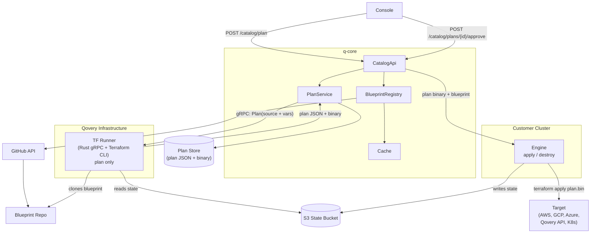
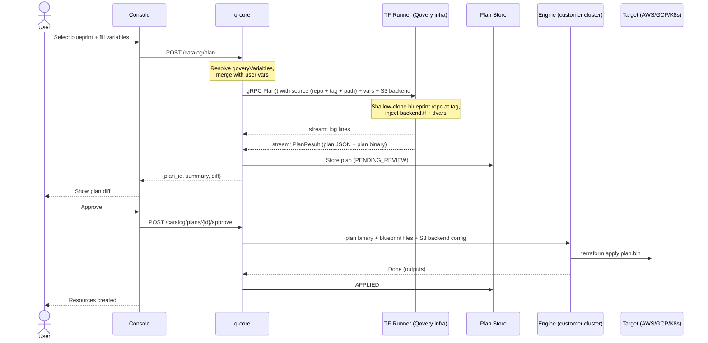
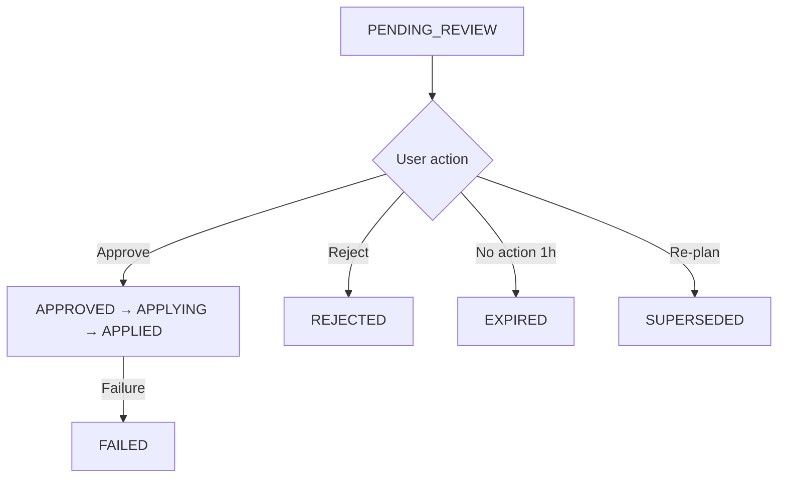

# Service Catalog -- Design

> **Date:** 2026-03-17

---

## Overview

Blueprints are standard Terraform modules with a `qsm.yml` manifest. `spec.provider` determines which credentials are injected. All blueprints follow the same plan → review → approve → apply workflow.

Planning happens on **Qovery's infrastructure** (TF runner). Applying happens on the **customer's cluster** (engine).

---

## Architecture



### Credential Injection

q-core reads `spec.provider` from the QSM and injects the appropriate credentials into both the TF runner (for plan) and the engine (for apply):

| `spec.provider` | Injected credentials |
|---|---|
| `aws` | `AWS_ACCESS_KEY_ID`, `AWS_SECRET_ACCESS_KEY` (from cluster config) |
| `gcp` | `GOOGLE_CREDENTIALS` (from cluster config) |
| `azure` | `ARM_CLIENT_ID`, `ARM_CLIENT_SECRET`, etc. (from cluster config) |
| `qovery` | `QOVERY_API_TOKEN` (org-scoped) |
| `helm` | `KUBECONFIG` (from cluster) |

For StackBlueprints with mixed providers, all needed credentials are injected.

---

## Workflow

```
1. BROWSE    → User selects a blueprint
2. CONFIGURE → User fills in variables (qoveryVariables pre-filled)
3. PLAN      → TF runner runs terraform plan, returns diff + binary planfile
4. REVIEW    → User sees what will be created/changed/destroyed
5. APPROVE   → User approves
6. APPLY     → Engine runs terraform apply plan.bin on customer's cluster
7. DONE      → Resources created, service tracked in catalog DB
```

### Provisioning Sequence



### Plan States



---

## Plan Object

| Field | Type | Description |
|-------|------|-------------|
| `id` | UUID | Plan identifier |
| `blueprint_name` | String | e.g. `aws-s3` |
| `blueprint_version` | String | e.g. `1.0.0` |
| `environment_id` | UUID | Target environment |
| `variables` | JSON | User-provided values |
| `plan_json` | JSON | Raw `terraform show -json` output (from TF runner) |
| `plan_binary` | Blob | Binary planfile for exact apply (from TF runner, forwarded to engine) |
| `status` | Enum | `PENDING_REVIEW`, `APPROVED`, `APPLYING`, `APPLIED`, `REJECTED`, `EXPIRED`, `FAILED`, `SUPERSEDED` |
| `created_at` | Timestamp | |
| `expires_at` | Timestamp | Auto-expire after 1h |
| `terraform_state_id` | UUID | TF state reference (for upgrades) |

---

## QSM Spec

### ServiceBlueprint

```yaml
apiVersion: "qovery.com/v2"
kind: ServiceBlueprint

metadata:
  name: "aws-s3"
  version: "1.0.0"
  description: "S3 bucket"

spec:
  provider: "aws"          # credential selector
  qoveryVariables:
    - name: "region"
      source: "cluster.region"
      overridable: true

  userVariables:
    - name: "bucket_name"
      type: "string"
      required: true

  outputs:
    - name: "bucket_arn"
      sensitive: false
```

### StackBlueprint

A StackBlueprint composes existing ServiceBlueprints. No Terraform files -- just orchestration.

```yaml
apiVersion: "qovery.com/v2"
kind: StackBlueprint

metadata:
  name: "production-stack"
  version: "1.0.0"
  categories: ["stack", "database", "cache"]

spec:
  stages:
    - name: "databases"
      services:
        - blueprint: "aws-postgresql"
          version: ">=1.0.0 <2.0.0"
          alias: "main-db"
          variables:
            instance_class: "db.r6g.large"
        - blueprint: "aws-redis"
          version: "1.x"
          alias: "cache"
    - name: "applications"
      services:
        - blueprint: "container-app"
          version: "1.0.0"
          alias: "api"
```

- Stages execute sequentially. Services in the same stage run in parallel.
- Each service gets its own independent `terraform plan` and TF state.
- `qoveryVariables` resolved per-service from the referenced blueprint.
- `variables` override the ServiceBlueprint's defaults.
- Version constraints: exact (`"1.2.0"`), train (`"1.x"`), range (`">=1.0.0 <2.0.0"`).

### Metadata-Only Updates

When a new version only changes `metadata` (description, icon, categories) and `spec` is identical, q-core updates the catalog entry immediately. No plan/apply, no engine run.

---

## API Endpoints

| Method | Path | Description |
|--------|------|-------------|
| `POST` | `/catalog/plan` | Create a plan (q-core calls TF runner) |
| `GET` | `/catalog/plans/{id}` | Get plan details |
| `POST` | `/catalog/plans/{id}/approve` | Approve and apply (q-core forwards to engine) |
| `POST` | `/catalog/plans/{id}/reject` | Reject |

---

## TF Runner Integration

### Plan Phase (TF runner, Qovery infra)

q-core calls the TF runner via gRPC `Plan()`:

1. Runner receives a blueprint reference (repo URL + git tag + subdirectory path), variables, S3 backend config, and env vars
2. Shallow-clones the blueprint repo at the specified tag, reads .tf files from the subdirectory
3. Injects `backend.tf` (generated from S3 config) and `terraform.tfvars.json` into the workspace
4. Runs `terraform init` (downloads providers, connects to S3 state)
5. Runs `terraform plan -out=plan.bin` (compares desired state vs current S3 state)
6. Runs `terraform show -json plan.bin` to produce the raw diff JSON
7. Streams log lines back to q-core during execution
8. Returns `PlanResult` with raw plan JSON + binary planfile + resource counts
9. Cleans up temp workspace

Alternatively, q-core can send pre-assembled files directly (fallback mode for testing or edge cases).

### Apply Phase (engine, customer cluster)

q-core sends the approved plan binary to the engine:

1. Engine receives blueprint files + plan binary + S3 backend config + credentials
2. Writes files, runs `terraform init` with same S3 backend
3. Runs `terraform apply plan.bin` (exact apply of what the user approved)
4. State updated in S3, outputs sent back to q-core

Binary planfile ensures what the user approved is exactly what gets applied.

### State

Each stack gets its own TF state in S3 backend (key: `catalog/{instance_id}/terraform.tfstate`). Both the TF runner (plan) and the engine (apply) use the same S3 backend config, ensuring state consistency.
