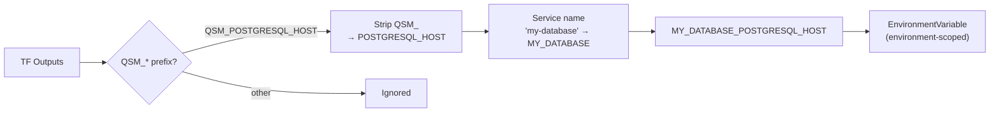

# Future -- Post-MVP Features

Features scoped out of MVP but designed for later implementation.

---

## Alias Bridge

Automatically turn Terraform outputs into environment-scoped variables so other services in the same environment can consume them.

### How it would work

1. Blueprint outputs are prefixed with `QSM_*` (e.g., `QSM_POSTGRESQL_HOST`)
2. After `terraform apply`, q-core scans outputs for the `QSM_*` prefix
3. Strip `QSM_` prefix → `POSTGRESQL_HOST`
4. Normalize the user-given service name → `MY_DATABASE`
5. Combine → `MY_DATABASE_POSTGRESQL_HOST`
6. Create as `EnvironmentVariable` (environment-scoped, available to all services)
7. Sensitive outputs → stored as secrets

### Example

Service name: `my-database`, blueprint: `aws-postgresql`

| Output | Environment variable |
|--------|---------------------|
| `QSM_POSTGRESQL_HOST` | `MY_DATABASE_POSTGRESQL_HOST` |
| `QSM_POSTGRESQL_PORT` | `MY_DATABASE_POSTGRESQL_PORT` |
| `QSM_POSTGRESQL_CONNECTION_STRING` | `MY_DATABASE_POSTGRESQL_CONNECTION_STRING` |

### Diagram

### Provisioning UI addition

When alias bridge is enabled, add a step to the provisioning flow:

1. Name the service
2. Fill variables
3. **Configure aliases** -- map `QSM_*` outputs to environment variable names
4. Plan → Review → Approve → Apply

### Helm outputs note

Helm has no native output mechanism. For `provider: "helm"` blueprints, outputs would be extracted using Terraform `kubernetes_*` data sources (read K8s services/configmaps/secrets created by the chart after `helm_release` completes). The `providers.tf` would need both `helm` and `kubernetes` providers.

---

## Upgrade Policies

Configurable auto-upgrade behavior per provisioned service:

| Policy | Behavior |
|--------|----------|
| `manual` (default) | Notification only. User must review and approve. |
| `auto_patch` | Auto-applies `x.y.Z` bumps. Skips minor/major. |
| `auto_minor` | Auto-applies `x.Y.z` bumps. Skips major. |

Major version bumps always require manual review.

Auto-upgrade preconditions:
- Service must be healthy (last deploy succeeded)
- All new variables must have defaults (guaranteed by semver rules for minor/patch)
- q-core runs a periodic check (every 15 min) for services with non-manual policies

---

## Notification System

Proactive notifications when blueprint updates are available, instead of relying on the user visiting the service page.
